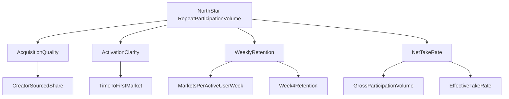

# RetroPick PMF and Validation Plan

## 1) PMF objective

RetroPick reaches PMF when it demonstrates repeat participation and trustworthy settlement behavior in a concentrated market wedge, with creator-led distribution compounding user growth.

PMF is not "high one-time traffic."  
PMF is sustained weekly behavior with healthy retention economics.

## 2) PMF hypotheses

## H1: Deterministic trust improves repeat usage
- Hypothesis: users who see transparent lock/close/settlement data have higher week-4 retention.
- Signal: retained cohort with settlement-proof interactions is materially higher than control.

## H2: Curated recurring templates outperform broad catalogs
- Hypothesis: a small recurring template set produces better liquidity concentration and repeat participation.
- Signal: top templates account for most volume with improving pool depth.

## H3: Creator-led distribution improves quality acquisition
- Hypothesis: creator-sourced users have better conversion and retention than paid/direct cold channels.
- Signal: creator cohort has lower CAC and higher week-4 activity.

## H4: Utility-framed products unlock non-crypto repeat behavior
- Hypothesis: non-crypto users adopt threshold/range products when framed as risk-expression/hedging tools.
- Signal: non-crypto segment repeat rate increases after utility-first onboarding and messaging.

## 3) Segment-specific PMF tests

| Segment | Problem tested | Primary test | Success threshold |
|---|---|---|---|
| Crypto-native | Need engaging differentiated loops | Recurring short-cycle + daily templates | W4 retention >= 20% and >= 3 markets/user/week in active cohort |
| Non-crypto financial users | Need clarity and utility | Utility-framed threshold/range journeys | W4 retention >= 12% and repeat in daily/weekly markets |
| Creators | Need distribution + monetization | Creator template campaigns and sharing loops | Creator-sourced new users >= 25% with positive retention delta |

## 4) KPI tree

## 5) Weekly metrics dashboard (minimum)

Acquisition:
- new users by channel,
- creator-sourced share,
- cost per activated user.

Activation:
- wallet/onboarding completion rate,
- time-to-first-position,
- first-session settlement understanding rate (product analytics proxy).

Retention:
- D7 and W4 retention by segment,
- markets per active user per week,
- repeat participation within first 14 days.

Market health:
- concentration ratio of top templates,
- median pool depth by template,
- invalid/void rate and settlement incident count.

Monetization:
- gross participation volume,
- effective take rate,
- net protocol fee after incentives.

## 6) Validation sprint cadence

## Sprint cycle (2 weeks)
1. Define one falsifiable hypothesis.
2. Launch one high-signal experiment.
3. Measure against pre-committed threshold.
4. Decide: ship, iterate, or kill.

## Experiment backlog (first 10 weeks)

1. **Settlement trust surface A/B**  
   Compare default card vs explicit lock/close/proof cards.

2. **Catalog concentration test**  
   6-template curated lobby vs 20-template expanded lobby.

3. **Creator onboarding path test**  
   Light creator tools with distribution prompts vs no creator prompts.

4. **Utility messaging test for non-crypto users**  
   "Speculate" framing vs "express/hedge" framing on same templates.

5. **Cadence mix test**  
   Heavy short-cycle mix vs balanced short/daily mix.

## 7) Go / no-go framework

## Go (continue scaling)
- W4 retention at or above thresholds in at least two segments,
- invalid/void rate stable and low,
- creator-sourced growth increasing with healthy cohort quality,
- gross participation volume trend positive for 8+ weeks.

## Pivot (adjust wedge)
- growth present but retention weak in one key segment,
- creator channel works but activation fails,
- concentration is weak due to template overload.

## No-go (stop current strategy branch)
- repeated failure to hit retention and repeat usage thresholds after 3 sprint cycles,
- trust incidents materially reducing behavior metrics,
- acquisition economics deteriorating without retention recovery.

## 8) Risks and mitigations

| Risk | Likely impact | Mitigation |
|---|---|---|
| Settlement ambiguity in UX | Retention and trust drop | Product-level deterministic proof surfaces and post-resolution explainers |
| Over-complex template launch | Conversion drop | Strict phased rollout with guided template education |
| Liquidity fragmentation | Poor user outcomes | Hard cap active templates per cadence window |
| Narrative inconsistency | Weak positioning | One canonical external narrative aligned with architecture reality |

## 9) PMF decision policy

RetroPick should treat PMF as a data-gated decision:
- scale only the templates and channels that prove repeat behavior,
- pause or kill markets that do not contribute to retention and concentrated liquidity,
- delay advanced template rollout until baseline PMF indicators remain stable.

## 10) PMF expansion from `validat-idea.md` seeds

How seeded ideas should be handled under PMF discipline:

1. **Exotic multi-type markets**  
   Keep only those that are launch-safe and explainable in one card.  
   PMF test: does this template increase repeat usage without fragmenting liquidity?

2. **Personal futures markets**  
   Treat as later-stage experiment only after legal/compliance and abuse controls are clear.  
   PMF test: can trust and fairness be maintained at scale?

3. **Scientific replication markets**  
   Run as narrow partner pilots, not consumer-core wedge.  
   PMF test: can a niche cohort sustain recurring participation?

4. **Conditional and multi-leg markets**  
   Keep in R&D until baseline PMF is proven in simpler deterministic templates.  
   PMF test: does added complexity improve user value more than it harms conversion?

5. **Conditional discovery feed**  
   Launch as content layer first, then transactional layer.  
   PMF test: can it increase quality acquisition and creator engagement?
