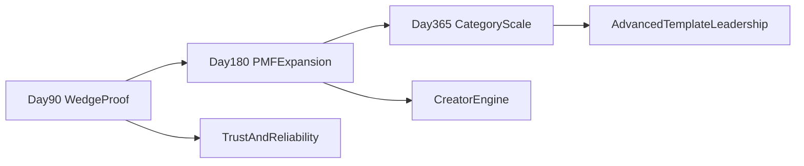

# RetroPick 90 / 180 / 365 Execution Roadmap

## 1) Roadmap objective

Turn strategy into phased execution with explicit KPI gates.  
The roadmap prioritizes:
- launch-safe deterministic templates,
- PMF evidence before complexity expansion,
- operational trust and reliability as non-negotiable foundations.

## 2) 0-90 days: wedge and trust foundation

## Product priorities
- Launch concentrated template set (`Direction`, `Threshold`, `RangeClose` + limited `Velocity` pilot).
- Build deterministic trust surfaces in product UI (rule card, lock/close data, settlement proof).
- Restrict active catalog count to preserve liquidity concentration.

## Growth priorities
- Creator-led campaign pilots for distribution.
- Segment onboarding paths: crypto-native fast path and utility-framed mainstream path.

## Operations priorities
- Settlement reliability runbook and incident response process.
- Lifecycle and oracle health dashboards for template operations.

## Success gates by day 90
- W4 retention meets threshold in at least one core segment.
- Invalid/void incidents remain within acceptable operational bounds.
- Top templates show strong participation concentration.

## 3) 91-180 days: PMF tightening and selective expansion

## Product priorities
- Expand into `Ladder` and selected advanced templates if 90-day gates are met.
- Improve creator tooling and analytics.
- Add guidance UX for advanced market understanding.

## Growth priorities
- Scale channels that demonstrate high-quality cohorts.
- Run category bundles for utility and macro narratives.

## Operations priorities
- Harden manual-only flows for advanced template operations.
- Improve risk checks for template launch and oracle mapping.

## Success gates by day 180
- W4 retention thresholds met in at least two segments.
- Creator-sourced users contribute meaningful share of quality inflow.
- Volume and repeat behavior trend positive across 8+ continuous weeks.

## 4) 181-365 days: category leadership expansion

## Product priorities
- Expand advanced intelligence templates (`Convergence`, `Composite`) where proven.
- Evaluate readiness for path-dependent families (`Corridor`, `Cascade`) only after data-path reliability criteria are satisfied.

## Growth priorities
- Region/category specialization with strongest demand and legal fit.
- Partnership-led distribution in target vertical communities.

## Operations priorities
- Scaling playbook for template portfolio governance.
- Formalized launch checklist per new market family.

## Success gates by day 365
- sustainable cohort retention and repeat participation,
- stable effective take economics,
- trusted settlement reputation with low incident profile,
- clear category differentiation recognized by users and creators.

## 5) Milestone map

## 6) KPI framework by phase

| Phase | Primary KPI | Secondary KPI | Decision |
|---|---|---|---|
| 0-90 | W4 retention in core segment | Market concentration ratio | Continue wedge or adjust onboarding/catalog |
| 91-180 | Multi-segment retention + repeat frequency | Creator cohort quality | Scale channels/templates or narrow |
| 181-365 | Sustainable participation growth | Net economics + trust metrics | Expand category leadership or consolidate |

## 7) Risk register and de-risk actions

| Risk | Phase exposure | De-risk action |
|---|---|---|
| Liquidity fragmentation | 0-180 | Cap active templates and enforce portfolio governance |
| Settlement trust breaks | 0-365 | Public post-settlement proof UX + strict incident runbook |
| Over-complex feature rollout | 91-365 | Gate advanced templates behind KPI and readiness checks |
| Messaging inconsistency | 0-180 | Maintain one canonical strategic narrative doc and product positioning |
| Operational overload | 91-365 | Template launch checklist, clear ownership, on-call structure |

## 8) Execution operating cadence

- Weekly: KPI review and hypothesis decision.
- Bi-weekly: validation sprint closeout and next experiment selection.
- Monthly: roadmap gate check and template portfolio rebalance.
- Quarterly: strategy reset based on PMF evidence and risk posture.

## 9) Recommended governance policy

No new market family should be promoted to core until:
1. settlement and oracle path are operationally reliable,
2. explanation UX is clear for first-time users,
3. pilot cohorts show repeat usage rather than one-off novelty,
4. impact on concentration/liquidity is net positive.

This keeps RetroPick from scaling complexity faster than user value and trust can support.
