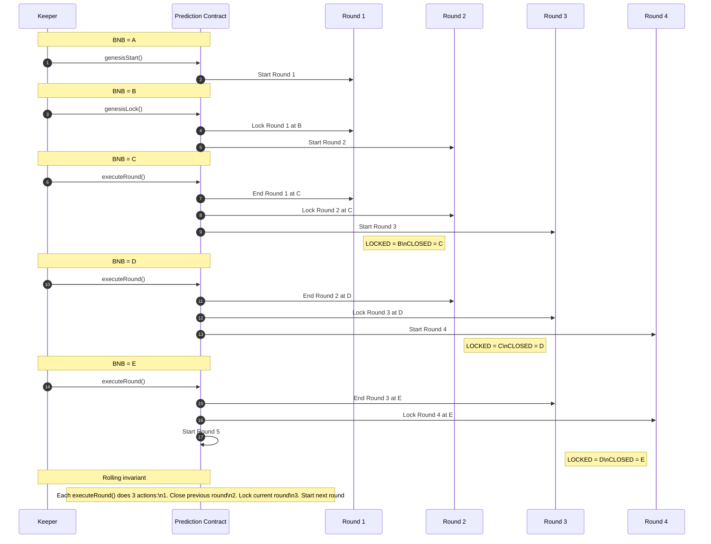
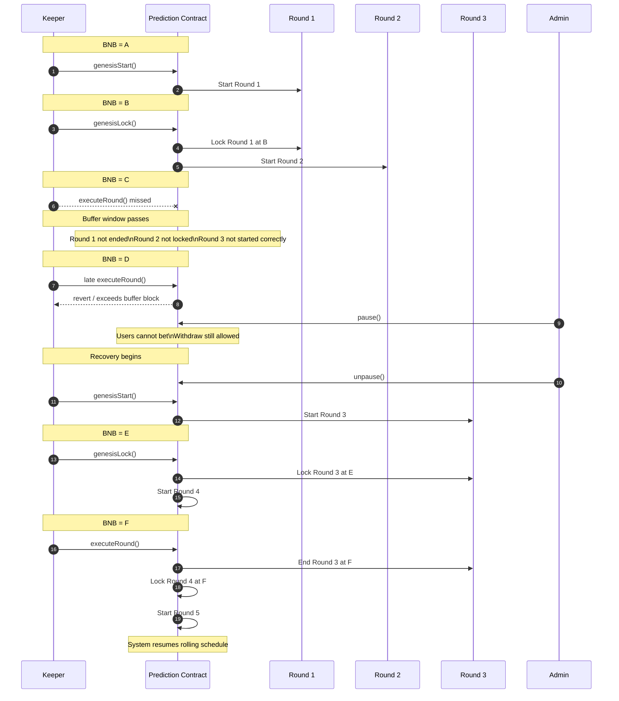
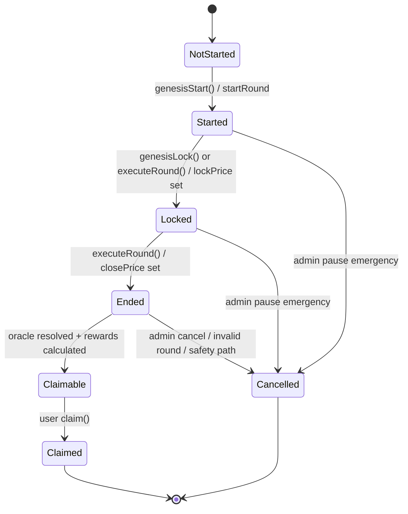
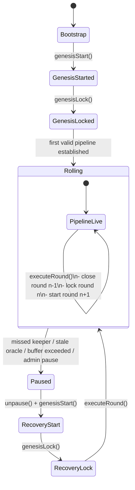
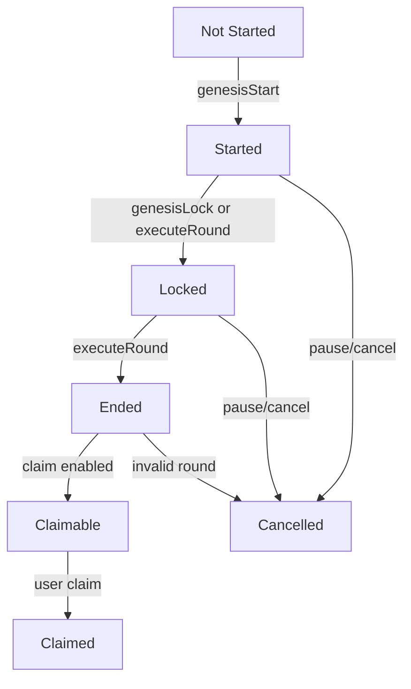

# RetroPick v6 Rolling Rounds

## Kick-start, steady-state execution, pause/recovery, and how it should be implemented

## 1. What this pattern is

This pattern is a **rolling round pipeline** for recurring markets.

Instead of treating each round as an isolated process with fully separate manual actions, the engine keeps **multiple rounds alive at once**, each in a different stage:

* one round is **open** for betting
* one round is **locked**
* one older round is being **ended / resolved**

This is the same operational idea behind Pancake-style recurring markets: the engine does not just “finish one round.” It continuously advances a pipeline.

In plain terms:

* `startGenesisRound()` creates the first live round
* `lockGenesisRound()` locks the first round and starts the second
* `executeRound()` then becomes the recurring heartbeat that:

  * ends one old round
  * locks the current round
  * starts the next round

That is why the rounds are **concurrent and inter-dependent**.

---

## 2. Why genesis exists

A rolling pipeline cannot start in steady state immediately.

To reach steady state, you first need:

Great fit for this system.

For Pancake-style recurring prediction rounds, these two diagram types are usually better than a plain flowchart:

* **Sequence diagram** → best for showing keeper/contract/timeline interactions
* **State machine diagram** → best for showing lifecycle of each round

Below I turned your two images into both styles.

---

# 1. Normal rolling operation — sequence diagram



---

# 2. Missing rounds / recovery — sequence diagram



---

# 3. Round lifecycle — state machine diagram

This is the cleanest way to explain one round.



---

# 4. Rolling multi-round state machine

This version explains the inter-dependency between adjacent rounds.



---

# 5. Technical state model for docs

You can paste this directly into your technical docs:



---

# 6. Best one to use in RetroPick docs

My recommendation:

* Use **sequence diagram** for the section explaining `genesisStart()`, `genesisLock()`, and `executeRound()`
* Use **state machine diagram** for the section explaining `RoundStatus`
* Use **rolling multi-round state machine** for the section explaining keeper failure and resume logic

---

### Step 1 — `startGenesisRound()`

Create **Round 1** in `Open`.

Users can bet in Round 1.

### Step 2 — wait one round interval

Let the open betting window for Round 1 complete.

### Step 3 — `lockGenesisRound()`

This does two things:

* locks **Round 1**
* starts **Round 2** in `Open`

At this point, the pipeline is initialized:

* Round 1 = locked
* Round 2 = open

Now the system is ready for recurring execution.

### Step 4 — wait one round interval

Now the round engine is ready for its first recurring step.

### Step 5 — `executeRound()`

This should do three things:

* **End Round 1**
* **Lock Round 2**
* **Start Round 3**

Now the engine is in rolling steady state.

---

## 3. What steady state means

Once rolling is live, every `executeRound()` advances the pipeline by exactly one interval.

If current state is:

* Round 2 = ended
* Round 3 = locked
* Round 4 = open

then the next `executeRound()` does:

* **End Round 3**
* **Lock Round 4**
* **Start Round 5**

So at all times, the system maintains a moving overlap.

## 3.1 Canonical invariant

In steady state, for one rolling template:

* latest started epoch = `k`
* latest locked epoch = `k - 1`
* latest resolved epoch = `k - 2`

Equivalent live view:

* epoch `k` = open
* epoch `k-1` = locked
* epoch `k-2` = resolved / closed

This should be the core invariant in v6.

---

## 4. What the first diagram is showing

The first diagram shows the **healthy recurring pipeline**.

Example progression:

### At genesis

* `genesisStart()` → Start 1

### After one interval

* `genesisLock()` → Lock 1, Start 2

### After next interval

* `executeRound()` → End 1, Lock 2, Start 3

### After next interval

* `executeRound()` → End 2, Lock 3, Start 4

### After next interval

* `executeRound()` → End 3, Lock 4, Start 5

This means one operator action advances the whole market family forward.

That is the operational efficiency you want in RetroPick v6.

---

## 5. Why the rounds are inter-dependent

They are inter-dependent because later rounds assume earlier rounds were processed on time.

If Round 2 is supposed to lock at time `T`, and Round 1 is supposed to end at time `T`, then `executeRound()` at time `T` is doing both:

* close previous round
* lock current round

If that execution is missed, the entire pipeline becomes inconsistent.

That is exactly what the second diagram is warning about.

---

## 6. What the second diagram is showing

The second diagram shows the **missed-round / missed-buffer failure mode**.

Here is the idea:

* Round 1 started
* Round 1 locked, Round 2 started
* the next `executeRound()` was supposed to happen on time
* but it did not happen within the allowed buffer

So now the engine has a problem:

* Round 1 should have ended already
* Round 2 should have locked already
* Round 3 should have started already
* but because the execution window was missed, those actions can no longer be treated as valid under the original timing assumptions

This is why the system must **halt** rather than try to continue blindly.

The diagram’s point is:

> once the rolling window is missed, do not pretend the pipeline is still healthy.

That is correct and should be encoded in v6.

---

## 7. What “buffer” means here

The buffer is the maximum tolerated delay around the expected execution boundary.

For example:

* round interval = `x`
* expected lock/end time = `T`
* allowed buffer = `b`

Then valid execution must happen within:

* `T <= now <= T + b`

If execution happens after `T + b`, the rolling lifecycle is considered broken.

This is critical because price-based markets are time-sensitive.
A late lock or late resolve can distort fairness.

So in v6:

* missing the buffer should not just be an ops alert
* it should produce a **state transition to halted**

---

## 8. Why pause/unpause + re-genesis is the correct recovery model

After a missed execution or similar operational fault, the safest recovery sequence is:

* `pause()`
* `unpause()`
* `startGenesisRound()`
* wait interval
* `lockGenesisRound()`
* wait interval
* `executeRound()`

This is not a cosmetic reset.
It is a **pipeline re-bootstrap**.

### Why pause

Pause prevents new bets into a lifecycle that is no longer trustworthy.

### Why unpause before genesis

You need a clean state transition back into operational mode.

### Why restart genesis

Because the pipeline must rebuild:

* one open round
* then one locked + one open round
* then rolling steady state

This is much safer than trying to partially repair a broken rolling cursor.

For v6, this should be the default recovery model.

---

# 9. How this should be implemented in RetroPick v6

## 9.1 Key principle

Do not rewrite RetroPick into PancakeSwap.

Implement this rolling behavior as a **template execution mode** inside the existing generalized engine.

That means:

* manual mode remains for flexible markets
* rolling mode is added for recurring templates

---

## 9.2 New execution mode

In `state/types.rs`:

```rust
pub enum ExecutionMode {
    Manual,
    RollingRecurring,
}
```

This lets each `MarketTemplate` choose between:

* current v5 manual lifecycle
* new v6 rolling lifecycle

---

## 9.3 New rolling state

Also in `state/types.rs`:

```rust
pub enum RollingState {
    Uninitialized,
    GenesisOpen,
    Live,
    Halted,
}
```

Meaning:

* `Uninitialized`: no rolling lifecycle started
* `GenesisOpen`: first round started, waiting for genesis lock
* `Live`: steady-state rolling execution active
* `Halted`: rolling lifecycle broken or manually stopped

This is the core state machine for recurring templates.

---

## 9.4 New ledger cursor fields

In `state/ledger.rs`, add:

* `rolling_state`
* `latest_started_epoch_id`
* `latest_locked_epoch_id`
* `latest_resolved_epoch_id`
* `current_open_epoch_id`
* `current_locked_epoch_id`
* `last_execute_ts`
* `halt_reason`
* `halted_at_epoch_id`

This turns `MarketLedger` into both:

* reserve/accounting ledger
* template-local rolling scheduler

That is exactly the right place for this logic.

---

## 9.5 New template fields

In `state/template.rs`, add:

* `execution_mode`
* `rolling_enabled`
* `rolling_buffer_seconds`
* `claim_window_seconds`
* `cleanup_delay_seconds`

These fields let each market template define:

* whether it is recurring
* how strict the timing buffer is
* how long claims stay open
* when cleanup is allowed

---

# 10. New v6 instruction set

## 10.1 `genesis_start_rolling_epoch`

Equivalent of `startGenesisRound()`.

### Responsibility

* create epoch 1 in `Open`
* set rolling state to `GenesisOpen`
* set:

  * `latest_started_epoch_id = 1`
  * `current_open_epoch_id = 1`

### Preconditions

* template exists
* template is rolling recurring
* rolling not yet initialized
* protocol not paused

---

## 10.2 `genesis_lock_rolling_epoch`

Equivalent of `lockGenesisRound()`.

### Responsibility

* lock epoch 1
* open epoch 2
* set rolling state to `Live`
* set:

  * `latest_locked_epoch_id = 1`
  * `latest_started_epoch_id = 2`
  * `current_locked_epoch_id = 1`
  * `current_open_epoch_id = 2`

### Preconditions

* rolling state is `GenesisOpen`
* epoch 1 is open
* oracle checkpoint valid
* timing window valid

---

## 10.3 `execute_rolling_epoch`

Equivalent of `executeRound()`.

### Responsibility

For steady state, one call must:

* resolve `latest_locked_epoch_id`
* lock `latest_started_epoch_id`
* open `latest_started_epoch_id + 1`

Then update ledger cursors.

### Result

If before execute:

* started = 4
* locked = 3
* resolved = 2

then after execute:

* started = 5
* locked = 4
* resolved = 3

This exactly matches the first diagram.

---

## 10.4 `pause_program`

Still needed.

In rolling mode, pause should:

* stop new participation
* stop rolling execution
* preserve claims/refunds as allowed

Pause should not destroy state immediately.

---

## 10.5 `resume_rolling_epoch`

This should be conservative in v6.

Recommended behavior:

* reset rolling state to `Uninitialized`
* require a fresh genesis sequence

Do not try to resume the pipeline from the middle in v6-alpha.

That is riskier and unnecessary initially.

---

# 11. Rolling execution algorithm in v6

## 11.1 Genesis

### Step A

Call `genesis_start_rolling_epoch(template)`.

Result:

* epoch 1 is open

### Step B

Wait exactly one open interval.

### Step C

Call `genesis_lock_rolling_epoch(template, oracle_update)`.

Result:

* epoch 1 locked
* epoch 2 open
* rolling pipeline becomes live

---

## 11.2 Steady state

For each interval:

Call `execute_rolling_epoch(template, resolve_epoch, lock_epoch, next_epoch, oracle_update)`.

### This must do:

1. resolve previous locked round
2. lock current open round
3. create/open next round

### Ledger cursor updates:

* `latest_resolved_epoch_id += 1`
* `latest_locked_epoch_id += 1`
* `latest_started_epoch_id += 1`

That is the recurring heartbeat.

---

# 12. Timing checks required in v6

This part is critical.

## 12.1 Expected transition times

Every round already has timing fields:

* open time
* lock time
* resolve/close time

In rolling mode, each execution must check that the current call is within the allowed window relative to the expected boundary.

### For example

If locking epoch `n` should happen at `epoch.lock_at`, then:

```text
epoch.lock_at <= now <= epoch.lock_at + rolling_buffer_seconds
```

If now is later than that:

* the rolling engine must halt

This should be implemented in a shared helper, not inline everywhere.

---

## 12.2 Why not allow late execution?

Because late execution breaks the market’s promised semantics.

If users expected:

* round locks at `T`
* resolution window behaves in a predictable way

then letting the operator lock/resolve much later can create unfairness.

So v6 should encode:

* **missed buffer = halt**

That is exactly what your second diagram implies.

---

# 13. Halt behavior in v6

## 13.1 When to halt

The rolling engine should halt if:

* execution buffer missed
* oracle unavailable
* oracle stale
* oracle confidence too wide
* sequence invariant broken
* manual admin halt
* protocol pause

## 13.2 What halt does

Set in `MarketLedger`:

* `rolling_state = Halted`
* `halt_reason = ...`
* `halted_at_epoch_id = ...`

Emit event:

* `RollingEpochHalted`

## 13.3 What halt does not do

It should not automatically wipe the market.

Claims and safe exits should remain possible where appropriate.

---

# 14. Resume / re-genesis behavior in v6

The safest model is exactly what you wrote:

* `pause()`
* `unpause()`
* `startGenesisRound()`
* wait interval
* `lockGenesisRound()`
* wait interval
* `executeRound()`

Mapped into v6:

* `pause_program`
* `resume_rolling_epoch` or admin reset
* `genesis_start_rolling_epoch`
* wait interval
* `genesis_lock_rolling_epoch`
* wait interval
* `execute_rolling_epoch`

This is the correct recovery path.

## Why this is correct

Because it does not assume the broken pipeline can be trusted anymore.

It rebuilds the rolling state from a clean genesis process.

---

# 15. Relation to current v5 instructions

The current v5 manual instructions remain valuable.

## 15.1 Manual mode

Keep:

* `open_epoch`
* `lock_epoch`
* `resolve_epoch`
* `cancel_epoch`

These should remain for:

* non-recurring templates
* debugging
* operational fallback

## 15.2 Rolling mode

Add:

* `genesis_start_rolling_epoch`
* `genesis_lock_rolling_epoch`
* `execute_rolling_epoch`

These should use shared internal helpers extracted from:

* `open_epoch`
* `lock_epoch`
* `resolve_epoch`

That prevents logic duplication.

---

# 16. Shared helper design

Create `instructions/market/helpers.rs`.

Add internal helpers:

* `do_open_epoch(...)`
* `do_lock_epoch(...)`
* `do_resolve_epoch(...)`
* `assert_rolling_sequence(...)`
* `check_rolling_buffer(...)`
* `halt_rolling_ledger(...)`

This is how manual and rolling execution stay consistent.

---

# 17. Rolling sequence invariant in v6

For every rolling template in `Live` state:

* `latest_started_epoch_id = k`
* `latest_locked_epoch_id = k - 1`
* `latest_resolved_epoch_id = k - 2`

and:

* `current_open_epoch_id = k`
* `current_locked_epoch_id = k - 1`

This should be enforced in code and tests.

---

# 18. How this interacts with RetroPick innovations

This is very important.

## 18.1 Multi-market resolvers stay

Rolling mode must not remove:

* `Direction`
* `Threshold`
* `RangeClose`

The execution pipeline is Pancake-like.
The resolver family remains RetroPick-like.

## 18.2 Template system stays

Rolling mode is configured **per template**, not globally.

That means:

* one template can be rolling
* another can remain manual

This is a major RetroPick strength.

## 18.3 Single-side mode stays

The deposit and switch-side mechanics remain part of the product layer.
They do not conflict with rolling lifecycle.

## 18.4 Oracle rigor stays

Oracle checks (staleness, confidence policy), freshness checks, feed binding—all remain.

This is another place where RetroPick should stay stricter than Pancake.

---

# 19. Claim and cleanup implications

Once a round is ended/resolved:

* claims open
* claims expire after configured window
* cleanup becomes allowed after delay

This means rolling mode must be paired with:

* `close_position`
* `close_epoch`

Otherwise recurring efficiency will improve operationally, but not economically enough.

---

# 20. Recommended v6 lifecycle states

For rolling templates:

## Template-level rolling state

* `Uninitialized`
* `GenesisOpen`
* `Live`
* `Halted`

## Epoch state

Still keep current `EpochStatus`:

* `Open`
* `Locked`
* `Resolved`
* `Cancelled`
* `Voided`

That separation is correct:

* template controls the rolling machine
* epoch controls the round lifecycle

---

# 21. Suggested technical doc wording for repo

## Kick-start rounds

Rolling recurring templates begin with a two-step genesis bootstrap. `genesis_start_rolling_epoch` opens the first epoch. After one interval, `genesis_lock_rolling_epoch` locks the first epoch and opens the second, transitioning the template into live rolling state. This bootstrap is necessary because a steady-state rolling market always requires one open epoch and one locked epoch before recurring execution can safely begin.

## Continue running rounds

Once live, `execute_rolling_epoch` becomes the recurring heartbeat of the template. Each call advances the pipeline by one interval: it resolves the previous locked epoch, locks the current open epoch, and opens the next epoch. This creates a concurrent and inter-dependent round structure where multiple epochs coexist in different lifecycle stages.

## Resuming rounds

If the rolling pipeline misses its valid execution buffer or encounters oracle/sequence failures, the template transitions to a halted state. Recovery should be conservative: pause if necessary, reset the rolling template state, and restart with a fresh genesis bootstrap using `genesis_start_rolling_epoch`, `genesis_lock_rolling_epoch`, and then steady-state `execute_rolling_epoch`.

---

# 22. Final implementation recommendation

If you implement this in the safest possible order:

### First

Build:

* rolling template fields
* ledger rolling state
* `genesis_start_rolling_epoch`
* `genesis_lock_rolling_epoch`
* `execute_rolling_epoch`

### Then

Add:

* claim expiry
* cleanup
* `close_position`
* `close_epoch`

### Then

Add:

* halt/recovery hardening
* richer resume path if ever needed

That is the right order.

---

# 23. Final one-line summary

**This genesis-lock-execute pattern is the rolling bootstrap and heartbeat of recurring markets: genesis creates the first open round, genesis lock creates the first overlapping open+locked pipeline, and execute continuously advances the template by resolving one round, locking the next, and starting another—while missed timing windows must halt the pipeline and require re-genesis.**

If you want, I can now turn this into a **repo-ready markdown document** with headings, code fences, and Mermaid diagrams for `docs/rolling-rounds-v6.md`.
