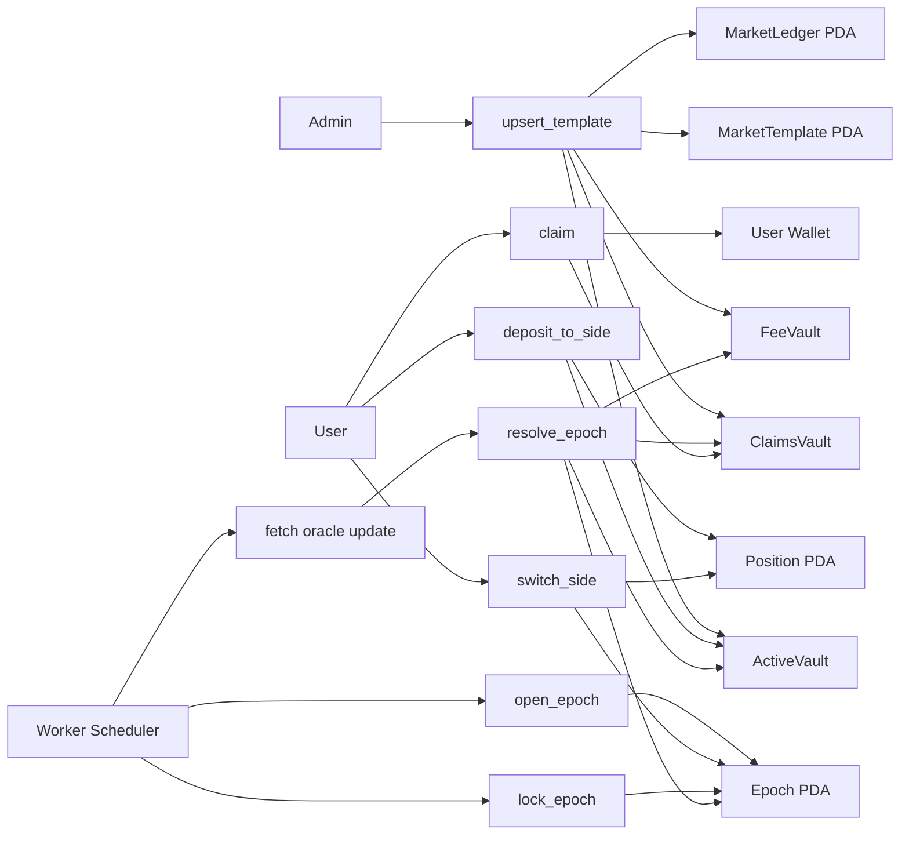
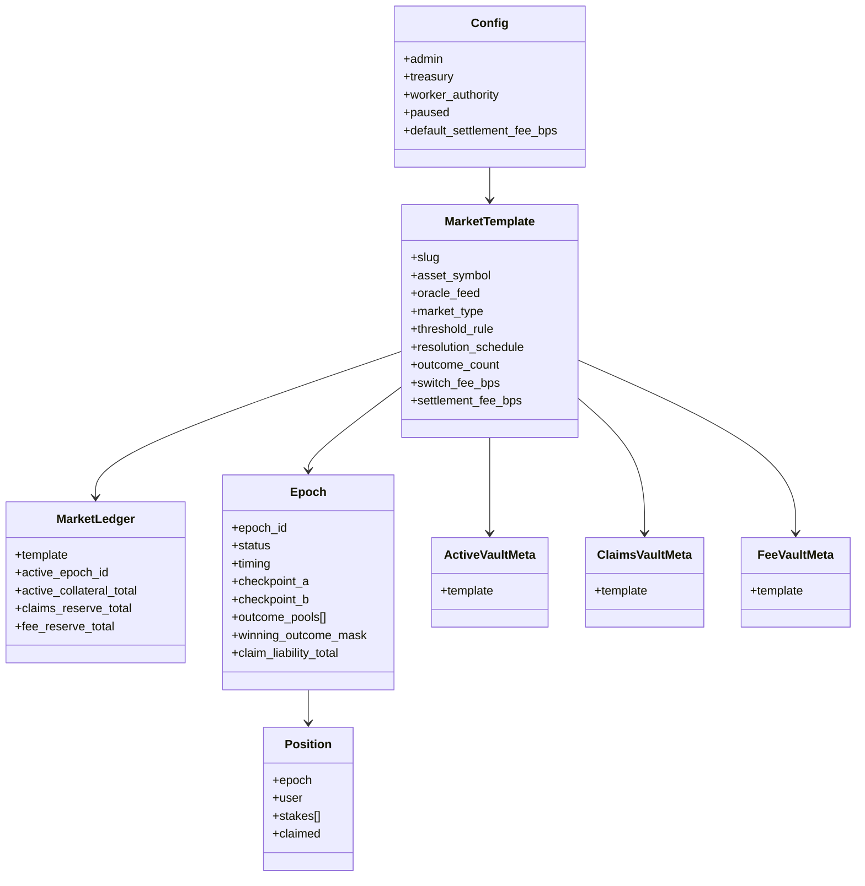
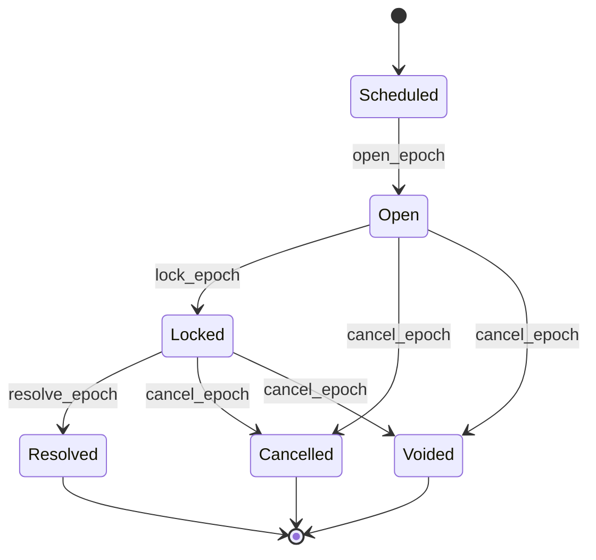

Below is the **updated implementation-ready architecture** for `programs/market_engine`, fully migrated from the legacy **one-market-one-vault-per-epoch** model into the new **one-template persistent-vault market engine**:

* **1 MarketTemplate**
* **1 ActiveVault**
* **1 ClaimsVault**
* **1 FeeVault**
* **many Epoch ledgers**
* **many Position(user, epoch) ledgers**
* **no new vault per epoch**
* **users may switch sides before lock**
* **backend orchestrates epochs and oracle updates**
* **program validates oracle data and computes winners onchain**

This fits Solana well because PDAs are deterministic, off-curve addresses derived from seeds and program ID, and only the owning program can sign for them through `invoke_signed`. Anchor’s `seeds` and `bump` constraints are the right way to enforce those addresses at the instruction boundary. ([Solana][1])

---

# RetroPick `programs/market_engine`

## Persistent Vault Market Engine

### Technical architecture, migration plan, and implementation spec

---

## 1. What changed from the legacy system

### Legacy model

The old model was:

* one concrete `Market` per round
* one `Vault` per market
* one `Position` per user per market
* worker creates a new market and vault every cycle
* users enter
* market resolves
* winners claim from that vault
* next round repeats with a new vault

That model is simple, but it creates repeated vault churn and does not support clean pre-lock side switching.

### New model

The new model is:

* one `MarketTemplate` for a recurring market
* one persistent `MarketLedger`
* one persistent `ActiveVault`
* one persistent `ClaimsVault`
* one persistent `FeeVault`
* one `Epoch` account per time slice
* one `Position` per user per epoch

That means:

* custody is **persistent**
* settlement is **epoch-isolated**
* claims are **ring-fenced**
* fees are **segregated**
* the same market can run forever without creating a new vault every 5 minutes

This is the right way to “reuse the same pool” without mixing old liabilities into new liquidity.

---

## 2. Core design thesis

The protocol should be modeled as:

### Market metadata

What the market is:

* BTC 5m Direction
* BTC Daily Threshold
* ETH Daily Range Close

### Persistent custody

Where tokens physically sit:

* `ActiveVault`
* `ClaimsVault`
* `FeeVault`

### Epoch accounting

Which liabilities belong to which time slice:

* epoch 1001
* epoch 1002
* epoch 1003

### Resolver logic

How oracle data maps to a winning outcome

### Payout engine

How losing pools are redistributed to winners after fees

The key point is:

> market type changes resolution logic, but custody, switching, epoch accounting, claims, and fees remain shared.

---

## 3. New program folder structure

```text
programs/market_engine/
  src/
    lib.rs
    constants.rs
    state/
      mod.rs
      types.rs
      config.rs
      template.rs
      ledger.rs
      epoch.rs
      position.rs
      vaults.rs
    instructions/
      admin/
        initialize.rs
        upsert_template.rs
        initialize_market.rs
        pause.rs
        set_worker.rs
        set_treasury.rs
      market/
        open_epoch.rs
        deposit_to_side.rs
        switch_side.rs
        lock_epoch.rs
        resolve_epoch.rs
        cancel_epoch.rs
        claim.rs
        withdraw_fees.rs
      mod.rs
    resolvers/
      mod.rs
      direction.rs
      threshold.rs
      range_close.rs
    math/
      mod.rs
      payout.rs
      switching.rs
      reserves.rs
    errors.rs
    events.rs
```

This keeps the entrypoint thin, isolates persistent state, separates instruction handlers, and makes resolver logic reusable. Anchor’s documented program model centers around typed account contexts, PDA bumps, and modular instruction handlers, so this layout maps cleanly to how Anchor wants programs to be structured. ([Anchor Language][2])

---

## 4. End-to-end system view



### Flow summary

1. Admin initializes a recurring market template and its persistent vaults.
2. Worker opens a new epoch ledger.
3. Users deposit into outcomes while epoch is open.
4. Users may switch sides before lock.
5. Worker locks the epoch.
6. Worker submits oracle update data.
7. Program validates oracle input, computes winner, moves aggregate claims to `ClaimsVault`, and moves fees to `FeeVault`.
8. Winners claim from `ClaimsVault`.
9. Worker opens the next epoch using the same vault set.

---

## 5. Core design principles

### 5.1 One template, persistent vaults, rolling epochs

There should be **one vault set per market template**, not one vault per epoch.

### 5.2 Internal ledgers, not YES/NO token vaults

For binary markets, do **not** create:

* `YesVault`
* `NoVault`

Instead:

* real tokens live in `ActiveVault`
* epoch state stores `outcome_pools[i]`

That means YES and NO are accounting buckets, not separate SPL token accounts.

### 5.3 Shared payout engine, pluggable resolvers

All market types share:

* deposits
* switching
* custody
* claim logic
* fee logic
* refund logic

Only winner computation differs.

### 5.4 Backend provides data, program decides truth

The backend may:

* open epochs
* fetch oracle updates
* submit transactions
* retry and monitor

The program must:

* validate PDA addresses
* validate state transitions
* validate oracle data
* compute the winning outcome onchain
* reserve claims and fees safely

Pyth’s Solana pull integration explicitly assumes off-chain participation in fetching/submitting updates, and Switchboard’s current Solana tutorial also uses a TypeScript client that fetches fresh oracle data and calls the program, which matches this worker-driven pattern. ([Pyth Developer Hub][3])

### 5.5 Write-once settlement fields

For each epoch:

* lock checkpoint written once
* final checkpoint written once
* winning mask written once

### 5.6 Claims and fees must be physically segregated

Old winner liabilities should not remain mixed with live trading collateral.
That is why `ClaimsVault` and `FeeVault` exist.

---

## 6. State model

## 6.1 `constants.rs`

```rust
pub const VERSION: u8 = 1;
pub const MAX_OUTCOMES: usize = 8;
pub const TEMPLATE_SLUG_MAX_LEN: usize = 32;
pub const ASSET_SYMBOL_MAX_LEN: usize = 16;
pub const RESERVED_SMALL: usize = 32;
pub const RESERVED_MEDIUM: usize = 64;
```

`MAX_OUTCOMES = 8` is enough for:

* binary Direction
* binary Threshold
* small Range markets

Keep arrays fixed-size. Avoid large dynamic vectors in V1. Anchor’s zero-copy path exists if you later need bigger accounts, and accounts above the normal `init` limit require the `zero` flow instead of standard `init`. ([Anchor Language][4])

---

## 6.2 `state/types.rs`

```rust
use anchor_lang::prelude::*;
use crate::MAX_OUTCOMES;

#[derive(AnchorSerialize, AnchorDeserialize, Clone, Copy, PartialEq, Eq, InitSpace)]
pub enum MarketType {
    Direction,
    Threshold,
    RangeClose,
}

#[derive(AnchorSerialize, AnchorDeserialize, Clone, Copy, PartialEq, Eq, InitSpace)]
pub enum Condition {
    AtOrAbove,
    Below,
}

#[derive(AnchorSerialize, AnchorDeserialize, Clone, Copy, PartialEq, Eq, InitSpace)]
pub enum ThresholdRule {
    None,
    Absolute,
    PreviousDailyClose,
    TodayOpen,
    WeeklyOpen,
    PreviousWeekClose,
    MondayOpen,
    PreviousMonthClose,
}

#[derive(AnchorSerialize, AnchorDeserialize, Clone, Copy, PartialEq, Eq, InitSpace)]
pub enum ResolutionSchedule {
    None,
    DailyClose,
    WeeklyClose,
    FridayClose,
    MonthEnd,
    CustomTimestamp,
}

#[derive(AnchorSerialize, AnchorDeserialize, Clone, Copy, PartialEq, Eq, InitSpace)]
pub enum EpochStatus {
    Scheduled,
    Open,
    Locked,
    Resolved,
    Cancelled,
    Voided,
}

#[derive(AnchorSerialize, AnchorDeserialize, Clone, Copy, PartialEq, Eq, InitSpace)]
pub enum OracleKind {
    Pyth,
    Switchboard,
}

#[derive(AnchorSerialize, AnchorDeserialize, Clone, Copy, PartialEq, Eq, InitSpace)]
pub enum CancelReason {
    None,
    OracleUnavailable,
    OracleStale,
    InvalidTemplate,
    InvalidTiming,
    EmergencyPaused,
    ManualAdminCancel,
}

#[derive(AnchorSerialize, AnchorDeserialize, Clone, Copy, PartialEq, Eq, InitSpace)]
pub enum StakeMintKind {
    NativeSol,
    SplToken,
}

#[derive(AnchorSerialize, AnchorDeserialize, Clone, Copy, PartialEq, Eq, InitSpace)]
pub struct OracleConfig {
    pub oracle_kind: OracleKind,
    pub max_delay_seconds: i64,
}

#[derive(AnchorSerialize, AnchorDeserialize, Clone, Copy, PartialEq, Eq, InitSpace, Default)]
pub struct OracleCheckpoint {
    pub value_e8: i128,
    pub publish_time: i64,
    pub confidence_e8: u64,
    pub written: bool,
}

#[derive(AnchorSerialize, AnchorDeserialize, Clone, Copy, PartialEq, Eq, InitSpace)]
pub struct MarketTiming {
    pub open_at: i64,
    pub lock_at: i64,
    pub resolve_at: i64,
}
```

---

## 6.3 `state/config.rs`

Global protocol config PDA.

```rust
use anchor_lang::prelude::*;
use crate::state::types::*;

#[account]
#[derive(InitSpace)]
pub struct Config {
    pub version: u8,
    pub bump: u8,

    pub admin: Pubkey,
    pub treasury: Pubkey,
    pub worker_authority: Pubkey,

    pub paused: bool,

    pub stake_mint_kind: StakeMintKind,
    pub stake_mint: Pubkey, // default() if NativeSol

    pub default_settlement_fee_bps: u16,
    pub max_switch_fee_bps: u16,
    pub max_outcomes: u8,

    pub oracle_config: OracleConfig,

    pub reserved: [u8; 32],
}
```

### PDA

```text
["config"]
```

### Invariants

* `admin != Pubkey::default()`
* `worker_authority != Pubkey::default()`
* `default_settlement_fee_bps <= 10_000`
* `max_switch_fee_bps <= 10_000`
* `max_outcomes as usize <= MAX_OUTCOMES`

---

## 6.4 `state/template.rs`

Reusable recurring market blueprint.

```rust
use anchor_lang::prelude::*;
use crate::state::types::*;
use crate::{TEMPLATE_SLUG_MAX_LEN, ASSET_SYMBOL_MAX_LEN, MAX_OUTCOMES};

#[account]
#[derive(InitSpace)]
pub struct MarketTemplate {
    pub version: u8,
    pub bump: u8,

    pub config: Pubkey,

    #[max_len(TEMPLATE_SLUG_MAX_LEN)]
    pub slug: String,

    #[max_len(ASSET_SYMBOL_MAX_LEN)]
    pub asset_symbol: String,

    pub oracle_feed: Pubkey,
    pub market_type: MarketType,
    pub condition: Condition,
    pub threshold_rule: ThresholdRule,
    pub resolution_schedule: ResolutionSchedule,

    pub active: bool,

    pub outcome_count: u8,

    pub open_offset_seconds: i64,
    pub lock_offset_seconds: i64,

    pub absolute_threshold_value_e8: i128,

    pub range_count: u8,
    pub range_bounds_e8: [i128; MAX_OUTCOMES - 1],

    pub switch_fee_bps: u16,
    pub settlement_fee_bps: u16,

    pub allow_multi_side_positions: bool,

    pub created_at: i64,
    pub updated_at: i64,

    pub reserved: [u8; 64],
}
```

### PDA

```text
["template", slug.as_bytes()]
```

### Validation rules

Direction:

* `outcome_count == 2`
* `threshold_rule == None`
* `range_count == 0`

Threshold:

* `outcome_count == 2`
* `threshold_rule != None`

RangeClose:

* `outcome_count >= 2`
* `range_count == outcome_count`
* bounds strictly increasing
* `threshold_rule == None`

---

## 6.5 `state/ledger.rs`

Persistent balance-sheet layer for a template.

```rust
use anchor_lang::prelude::*;

#[account]
#[derive(InitSpace)]
pub struct MarketLedger {
    pub version: u8,
    pub bump: u8,

    pub template: Pubkey,

    pub active_epoch_id: u64,
    pub last_resolved_epoch_id: u64,

    pub active_collateral_total: u64,
    pub claims_reserve_total: u64,
    pub fee_reserve_total: u64,
    pub insurance_reserve_total: u64,

    pub reserved: [u8; 64],
}
```

### PDA

```text
["ledger", template.key().as_ref()]
```

This is the market-wide solvency layer.

---

## 6.6 `state/epoch.rs`

Per-epoch settlement ledger.

```rust
use anchor_lang::prelude::*;
use crate::state::types::*;
use crate::MAX_OUTCOMES;

#[account]
#[derive(InitSpace)]
pub struct Epoch {
    pub version: u8,
    pub bump: u8,

    pub ledger: Pubkey,
    pub template: Pubkey,

    pub epoch_id: u64,
    pub status: EpochStatus,
    pub cancel_reason: CancelReason,

    pub timing: MarketTiming,

    pub checkpoint_a: OracleCheckpoint,
    pub checkpoint_b: OracleCheckpoint,

    pub oracle_feed: Pubkey,

    pub outcome_count: u8,
    pub winning_outcome_mask: u64,

    pub total_pool: u64,
    pub outcome_pools: [u64; MAX_OUTCOMES],

    pub switch_fee_total: u64,
    pub settlement_fee_total: u64,

    pub claim_liability_total: u64,
    pub claimed_total: u64,

    pub created_at: i64,
    pub locked_at: i64,
    pub resolved_at: i64,

    pub total_positions: u32,

    pub reserved: [u8; 64],
}
```

### PDA

```text
["epoch", template.key().as_ref(), &epoch_id.to_le_bytes()]
```

### Meaning

* `checkpoint_a`

  * Direction: lock price
  * Threshold: threshold/reference checkpoint
  * RangeClose: optional or unused
* `checkpoint_b`

  * final price for all supported market types

---

## 6.7 `state/position.rs`

Per-user per-epoch position.

```rust
use anchor_lang::prelude::*;
use crate::MAX_OUTCOMES;

#[account]
#[derive(InitSpace)]
pub struct Position {
    pub version: u8,
    pub bump: u8,

    pub epoch: Pubkey,
    pub user: Pubkey,

    pub stakes: [u64; MAX_OUTCOMES],
    pub total_stake: u64,

    pub switch_fees_paid: u64,
    pub entry_fees_paid: u64,

    pub claimed_amount: u64,
    pub claimed: bool,

    pub created_at: i64,
    pub updated_at: i64,

    pub reserved: [u8; 32],
}
```

### PDA

```text
["position", epoch.key().as_ref(), user.key().as_ref()]
```

### Policy

State supports multi-outcome stake arrays.
Instruction logic can initially enforce one-sided net exposure for V1.

---

## 6.8 `state/vaults.rs`

Persistent vault metadata.

```rust
use anchor_lang::prelude::*;
use crate::state::types::*;

#[account]
#[derive(InitSpace)]
pub struct ActiveVaultMeta {
    pub version: u8,
    pub bump: u8,
    pub template: Pubkey,
    pub mint_kind: StakeMintKind,
    pub mint: Pubkey,
    pub created_at: i64,
    pub reserved: [u8; 32],
}

#[account]
#[derive(InitSpace)]
pub struct ClaimsVaultMeta {
    pub version: u8,
    pub bump: u8,
    pub template: Pubkey,
    pub mint_kind: StakeMintKind,
    pub mint: Pubkey,
    pub created_at: i64,
    pub reserved: [u8; 32],
}

#[account]
#[derive(InitSpace)]
pub struct FeeVaultMeta {
    pub version: u8,
    pub bump: u8,
    pub template: Pubkey,
    pub mint_kind: StakeMintKind,
    pub mint: Pubkey,
    pub created_at: i64,
    pub reserved: [u8; 32],
}
```

### PDA seeds

```text
["active_vault", template.key().as_ref()]
["claims_vault", template.key().as_ref()]
["fee_vault", template.key().as_ref()]
```

For SPL-token settlement, these PDAs should own token accounts, and PDA signing for token transfers should use `with_signer`, exactly as Anchor’s token docs describe. ([Anchor Language][5])

---

## 7. Helper impls

### `template.rs`

```rust
impl MarketTemplate {
    pub fn validate(&self) -> Result<()> {
        require!(self.outcome_count as usize <= crate::MAX_OUTCOMES, crate::errors::MarketError::TooManyOutcomes);

        match self.market_type {
            MarketType::Direction => {
                require!(self.outcome_count == 2, crate::errors::MarketError::InvalidTemplate);
                require!(self.threshold_rule == ThresholdRule::None, crate::errors::MarketError::InvalidTemplate);
                require!(self.range_count == 0, crate::errors::MarketError::InvalidTemplate);
            }
            MarketType::Threshold => {
                require!(self.outcome_count == 2, crate::errors::MarketError::InvalidTemplate);
                require!(self.threshold_rule != ThresholdRule::None, crate::errors::MarketError::InvalidTemplate);
            }
            MarketType::RangeClose => {
                require!(self.outcome_count >= 2, crate::errors::MarketError::InvalidTemplate);
                require!(self.range_count == self.outcome_count, crate::errors::MarketError::InvalidTemplate);
            }
        }

        require!(self.switch_fee_bps <= 10_000, crate::errors::MarketError::InvalidFeeBps);
        require!(self.settlement_fee_bps <= 10_000, crate::errors::MarketError::InvalidFeeBps);

        Ok(())
    }

    pub fn requires_checkpoint_a_on_lock(&self) -> bool {
        matches!(self.market_type, MarketType::Direction)
    }

    pub fn requires_checkpoint_a_on_open(&self) -> bool {
        matches!(self.market_type, MarketType::Threshold)
    }
}
```

### `epoch.rs`

```rust
impl Epoch {
    pub fn is_open(&self, now: i64) -> bool {
        self.status == EpochStatus::Open && now < self.timing.lock_at
    }

    pub fn is_lockable(&self, now: i64) -> bool {
        self.status == EpochStatus::Open && now >= self.timing.lock_at
    }

    pub fn is_resolvable(&self, now: i64) -> bool {
        self.status == EpochStatus::Locked && now >= self.timing.resolve_at
    }

    pub fn winning_pool_total(&self) -> u64 {
        let mut sum = 0u64;
        for i in 0..self.outcome_count as usize {
            if (self.winning_outcome_mask & (1u64 << i)) != 0 {
                sum = sum.saturating_add(self.outcome_pools[i]);
            }
        }
        sum
    }
}
```

### `position.rs`

```rust
impl Position {
    pub fn stake_for_outcome(&self, outcome_index: usize) -> u64 {
        self.stakes[outcome_index]
    }

    pub fn total_winning_stake(&self, winning_mask: u64, outcome_count: u8) -> u64 {
        let mut sum = 0u64;
        for i in 0..outcome_count as usize {
            if (winning_mask & (1u64 << i)) != 0 {
                sum = sum.saturating_add(self.stakes[i]);
            }
        }
        sum
    }
}
```

---

## 8. Instruction set

## 8.1 Admin

### `initialize_config`

Creates `Config`.

### `upsert_template`

Creates or updates `MarketTemplate`.

### `initialize_market`

Creates:

* `MarketLedger`
* `ActiveVault`
* `ClaimsVault`
* `FeeVault`

This happens **once per template**.

### `pause_program`

Toggles emergency pause.

### `set_worker_authority`

Updates worker signer.

### `set_treasury`

Updates treasury destination.

---

## 8.2 Market lifecycle

### `open_epoch`

Creates a new `Epoch`.

Responsibilities:

* require template active
* require not paused
* require signer is worker/admin
* derive next epoch id
* compute timing
* initialize zero pools
* set status = `Open`

### `deposit_to_side`

User enters a side.

Responsibilities:

* require epoch open
* require `now < lock_at`
* validate outcome index
* transfer user funds into `ActiveVault`
* create/update `Position`
* increment `epoch.outcome_pools[outcome]`
* increment `epoch.total_pool`
* increment `ledger.active_collateral_total`

### `switch_side`

Reallocate from one side to another before lock.

Responsibilities:

* require epoch open
* require `from != to`
* require user has enough source exposure
* debit source stake
* compute switch fee
* credit destination with net amount
* update epoch pools
* update `position.switch_fees_paid`
* increase `epoch.switch_fee_total`
* increase `ledger.fee_reserve_total`

### `lock_epoch`

Locks the epoch.

Responsibilities:

* require epoch open
* require `now >= lock_at`
* if Direction, write `checkpoint_a`
* set status = `Locked`

### `resolve_epoch`

Finalizes result.

Responsibilities:

* require epoch locked
* require `now >= resolve_at`
* validate oracle feed and freshness
* write `checkpoint_b`
* compute winner onchain
* compute settlement fee
* compute claim liability
* move aggregate claim liability from `ActiveVault` to `ClaimsVault`
* move settlement fees to `FeeVault`
* decrement `ledger.active_collateral_total`
* increment `ledger.claims_reserve_total`
* increment `ledger.fee_reserve_total`
* set epoch status = `Resolved`

### `cancel_epoch`

Voids the epoch.

Responsibilities:

* allow only valid cancel reasons
* status = `Cancelled` or `Voided`
* all claims become refunds
* no settlement fee

### `claim`

Transfers winnings or refunds.

Responsibilities:

* require resolved/voided/cancelled
* require position exists
* compute claim amount
* prevent double claim
* transfer from `ClaimsVault`
* decrement `ledger.claims_reserve_total`
* increment `epoch.claimed_total`
* update position claimed fields

### `withdraw_fees`

Treasury pulls from `FeeVault`.

Responsibilities:

* only admin/treasury
* transfer from `FeeVault`
* decrement `ledger.fee_reserve_total`

---

## 9. Resolver modules

These remain pure-ish logic modules.
They must not move funds.

## 9.1 `resolvers/direction.rs`

Inputs:

* `checkpoint_a` = locked price
* `checkpoint_b` = final price

Output:

* bit 0 wins if final > locked
* bit 1 wins if final < locked
* if equal, either:

  * refund/void, or
  * explicit draw rule

For V1, **void on equality** is the cleanest.

## 9.2 `resolvers/threshold.rs`

Inputs:

* `checkpoint_a` = threshold/reference value
* `checkpoint_b` = final value
* `condition`

Output:

* YES if rule satisfied
* NO otherwise

## 9.3 `resolvers/range_close.rs`

Inputs:

* `checkpoint_b` = final value
* `range_bounds_e8`

Output:

* exactly one winning band

---

## 10. Payout math

## `math/payout.rs`

### Shared formula

```text
total_pool = Σ outcome_pools[i]
winning_pool = Σ outcome_pools[winners]
losing_pool = total_pool - winning_pool
settlement_fee = fee_policy(losing_pool or total_pool)
distributable_losing_pool = losing_pool - settlement_fee
```

Winner payout:

```text
user_payout =
user_winning_stake +
(user_winning_stake / winning_pool) * distributable_losing_pool
```

Refund payout on cancel/void:

```text
user_payout = user.total_stake
```

### Suggested functions

```rust
pub fn compute_settlement_fee(total_pool: u64, losing_pool: u64, fee_bps: u16, fee_on_losing_pool: bool) -> Result<u64>;

pub fn compute_claim_liability(epoch: &Epoch, fee_bps: u16, fee_on_losing_pool: bool) -> Result<u64>;

pub fn compute_user_claim(epoch: &Epoch, position: &Position, fee_bps: u16, fee_on_losing_pool: bool) -> Result<u64>;
```

---

## 11. Switching math

## `math/switching.rs`

```rust
pub fn compute_switch(gross_amount: u64, switch_fee_bps: u16) -> Result<(u64, u64)> {
    let fee = gross_amount
        .checked_mul(switch_fee_bps as u64)
        .ok_or(MarketError::MathOverflow)?
        / 10_000;
    let net = gross_amount.checked_sub(fee).ok_or(MarketError::MathOverflow)?;
    Ok((net, fee))
}
```

### Example

If Alice switches 40 units with 2% fee:

* gross = 40
* fee = 0.8
* net credit = 39.2

In integer math this should use token decimals or fixed-point conventions consistently.

---

## 12. Reserve accounting

## `math/reserves.rs`

```rust
pub fn move_claim_liability(
    ledger: &mut MarketLedger,
    amount: u64,
) -> Result<()> {
    ledger.active_collateral_total = ledger.active_collateral_total
        .checked_sub(amount)
        .ok_or(MarketError::MathOverflow)?;
    ledger.claims_reserve_total = ledger.claims_reserve_total
        .checked_add(amount)
        .ok_or(MarketError::MathOverflow)?;
    Ok(())
}

pub fn move_fee_reserve(
    ledger: &mut MarketLedger,
    amount: u64,
) -> Result<()> {
    ledger.active_collateral_total = ledger.active_collateral_total
        .checked_sub(amount)
        .ok_or(MarketError::MathOverflow)?;
    ledger.fee_reserve_total = ledger.fee_reserve_total
        .checked_add(amount)
        .ok_or(MarketError::MathOverflow)?;
    Ok(())
}
```

---

## 13. PDA layout

```text
["config"]
["template", slug.as_bytes()]
["ledger", template.key().as_ref()]
["active_vault", template.key().as_ref()]
["claims_vault", template.key().as_ref()]
["fee_vault", template.key().as_ref()]
["epoch", template.key().as_ref(), &epoch_id.to_le_bytes()]
["position", epoch.key().as_ref(), user.key().as_ref()]
```

This is a strong fit for Anchor because `#[account(seeds, bump)]` checks that the expected PDA is being passed in. ([Anchor Language][6])

---

## 14. Account relationship diagram



---

## 15. Epoch state machine



Keep it tight onchain.

---

## 16. Validation checklists

### `open_epoch`

* protocol not paused
* signer is worker/admin
* template active
* epoch id not already used
* timing valid
* oracle feed matches template

### `deposit_to_side`

* protocol not paused
* epoch status = Open
* now < lock_at
* valid outcome index
* positive stake
* transfer to `ActiveVault` succeeds

### `switch_side`

* protocol not paused
* epoch status = Open
* now < lock_at
* `from != to`
* user has enough source stake
* fee computed safely

### `lock_epoch`

* epoch status = Open
* now >= lock_at
* if Direction, `checkpoint_a` not already written and valid oracle update available

### `resolve_epoch`

* epoch status = Locked
* now >= resolve_at
* `checkpoint_b` not already written
* oracle feed identity valid
* publish time fresh enough
* winner computed successfully
* claim liability and settlement fee fit inside pool math

### `claim`

* epoch status in {Resolved, Cancelled, Voided}
* position exists
* user has nonzero claim
* not already fully claimed
* transfer from `ClaimsVault` succeeds

### `withdraw_fees`

* signer authorized
* amount <= fee reserve
* transfer from `FeeVault` succeeds

---

## 17. Solvency invariants

These are mandatory.

### Invariant 1

For any open epoch:

`sum(position.stakes[i]) across users == epoch.outcome_pools[i]`

for each outcome `i`.

### Invariant 2

On every switch:

`gross_debit = net_credit + switch_fee`

### Invariant 3

After lock:

* no deposits
* no switching
* no position mutation

### Invariant 4

For resolved epoch:

`epoch.claimed_total <= epoch.claim_liability_total`

### Invariant 5

Market-wide solvency:

`ledger.active_collateral_total + ledger.claims_reserve_total + ledger.fee_reserve_total + ledger.insurance_reserve_total <= actual vault balances`

### Invariant 6

Treasury withdrawals only reduce `FeeVault`

### Invariant 7

Funds reserved in `ClaimsVault` are never counted as free liquidity for new epochs

---

## 18. Main attack surfaces and mitigations

### Lock-boundary race

A user tries to switch at the exact lock boundary.

Mitigation:

* hard onchain timestamp check using `Clock`
* reject `now >= lock_at`

### Double claim

A user tries to claim twice.

Mitigation:

* `claimed_amount`
* `claimed` flag
* idempotent claim math

### Liability leakage

Old claims accidentally used as new collateral.

Mitigation:

* aggregate move to `ClaimsVault`
* explicit `claims_reserve_total`

### Premature fee withdrawal

Treasury drains funds that are still economically reserved.

Mitigation:

* segregated `FeeVault`
* treasury only touches fee reserve

### Incorrect switch accounting

Source and destination pools diverge from position state.

Mitigation:

* central switching helper
* invariant tests
* property fuzzing

### Oracle staleness

A stale price produces the wrong winner.

Mitigation:

* freshness windows
* validate publish time
* void/cancel path

### Wrong PDA injection

Malicious caller passes wrong vault or epoch account.

Mitigation:

* Anchor PDA constraints with `seeds` and `bump` on all critical accounts. ([Anchor Language][6])

---

## 19. Oracle integration model

### Pyth path

Pyth’s Solana pull integration assumes off-chain processes fetch and submit updates or rely on updated price feed accounts, which fits your worker model. ([Pyth Developer Hub][3])

### Switchboard path

Switchboard’s current Solana tutorial says the basic flow is a TypeScript client fetching fresh oracle data and calling an Anchor program, with canonical accounts derived from feed IDs and a managed update system. ([Switchboard Dokumentasi][7])

### Recommended principle

The backend should:

* fetch updates
* prepare accounts
* submit transaction

The program should:

* verify oracle source/freshness
* store checkpoints
* compute winner itself

---

## 20. Cost implications

This new architecture removes repeated vault creation per epoch.
That matters because Solana charges a base fee of **5,000 lamports per signature** plus optional priority fees, and account creation adds rent overhead. By keeping vaults persistent, your recurring cost moves toward:

* epoch account creation
* position account creation
* worker/oracle txs
  instead of repeated vault creation. ([Solana][8])

---

## 21. Errors

## `errors.rs`

```rust
use anchor_lang::prelude::*;

#[error_code]
pub enum MarketError {
    #[msg("Unauthorized")]
    Unauthorized,
    #[msg("Protocol paused")]
    ProtocolPaused,

    #[msg("Invalid template")]
    InvalidTemplate,
    #[msg("Template inactive")]
    TemplateInactive,
    #[msg("Too many outcomes")]
    TooManyOutcomes,
    #[msg("Invalid fee basis points")]
    InvalidFeeBps,

    #[msg("Invalid epoch state")]
    InvalidEpochState,
    #[msg("Betting closed")]
    BettingClosed,
    #[msg("Too early to lock")]
    TooEarlyToLock,
    #[msg("Too early to resolve")]
    TooEarlyToResolve,
    #[msg("Epoch already resolved")]
    EpochAlreadyResolved,

    #[msg("Invalid oracle feed")]
    InvalidOracleFeed,
    #[msg("Oracle stale")]
    OracleStale,
    #[msg("Checkpoint already written")]
    CheckpointAlreadyWritten,

    #[msg("Invalid outcome")]
    InvalidOutcome,
    #[msg("Zero stake")]
    ZeroStake,
    #[msg("Insufficient source stake")]
    InsufficientSourceStake,
    #[msg("Nothing to claim")]
    NothingToClaim,
    #[msg("Already claimed")]
    AlreadyClaimed,

    #[msg("Math overflow")]
    MathOverflow,
}
```

---

## 22. Events

## `events.rs`

```rust
use anchor_lang::prelude::*;

#[event]
pub struct ConfigInitialized {
    pub admin: Pubkey,
    pub treasury: Pubkey,
}

#[event]
pub struct TemplateUpserted {
    pub template: Pubkey,
    pub slug: String,
}

#[event]
pub struct MarketInitialized {
    pub template: Pubkey,
    pub ledger: Pubkey,
}

#[event]
pub struct EpochOpened {
    pub template: Pubkey,
    pub epoch: Pubkey,
    pub epoch_id: u64,
}

#[event]
pub struct PositionDeposited {
    pub epoch: Pubkey,
    pub user: Pubkey,
    pub outcome: u8,
    pub amount: u64,
}

#[event]
pub struct SideSwitched {
    pub epoch: Pubkey,
    pub user: Pubkey,
    pub from_outcome: u8,
    pub to_outcome: u8,
    pub gross_amount: u64,
    pub fee_amount: u64,
    pub net_amount: u64,
}

#[event]
pub struct EpochLocked {
    pub epoch: Pubkey,
    pub epoch_id: u64,
}

#[event]
pub struct EpochResolved {
    pub epoch: Pubkey,
    pub epoch_id: u64,
    pub winning_mask: u64,
    pub claim_liability_total: u64,
    pub settlement_fee_total: u64,
}

#[event]
pub struct EpochCancelled {
    pub epoch: Pubkey,
    pub epoch_id: u64,
}

#[event]
pub struct Claimed {
    pub epoch: Pubkey,
    pub user: Pubkey,
    pub amount: u64,
}

#[event]
pub struct FeesWithdrawn {
    pub template: Pubkey,
    pub amount: u64,
}
```

Anchor supports events for off-chain indexing and state tracking. ([Anchor Language][2])

---

## 23. Migration guide from legacy code

### Remove

* `state/market.rs` as custody boundary
* `state/vault.rs` per market-instance vault
* `create_market.rs`
* `place_position.rs`
* `lock_market.rs`
* `resolve_market.rs`
* `cancel_market.rs`

### Replace with

* `state/template.rs`
* `state/ledger.rs`
* `state/epoch.rs`
* `state/vaults.rs`
* `open_epoch.rs`
* `deposit_to_side.rs`
* `switch_side.rs`
* `lock_epoch.rs`
* `resolve_epoch.rs`
* `cancel_epoch.rs`

### Keep conceptually

* resolver modules
* payout math module
* config/admin controls
* claim flow

### Key semantic migration

Old:

* `Market` = round + vault + settlement

New:

* `MarketTemplate` = recurring market definition
* `Epoch` = round settlement boundary
* `Vaults` = persistent custody
* `MarketLedger` = balance sheet

That is the biggest conceptual shift.

---

## 24. Implementation order

### Phase 1

* `constants.rs`
* `state/types.rs`
* `state/config.rs`
* `state/template.rs`
* `state/ledger.rs`
* `state/epoch.rs`
* `state/position.rs`
* `state/vaults.rs`

### Phase 2

* `errors.rs`
* `events.rs`
* helper impls

### Phase 3

* admin instructions
* `initialize_config`
* `upsert_template`
* `initialize_market`

### Phase 4

* `open_epoch`
* `deposit_to_side`
* `switch_side`

### Phase 5

* `lock_epoch`
* resolvers
* `resolve_epoch`

### Phase 6

* `claim`
* `withdraw_fees`
* `cancel_epoch`

### Phase 7

* integration tests
* fuzz/invariant tests
* oracle wiring

---

## 25. Final architecture summary

`programs/market_engine` should now be implemented as:

* **one Anchor program**
* **one persistent market custody domain per template**
* **one ActiveVault**
* **one ClaimsVault**
* **one FeeVault**
* **one MarketLedger**
* **many Epoch accounts**
* **many Position(user, epoch) accounts**
* **shared switching and payout core**
* **pluggable resolvers**
* **worker-driven epoch orchestration**
* **program-side oracle validation and winner computation**

That gives you:

* lower account churn
* no new vault per epoch
* safe claim segregation
* clean fee withdrawal
* auditable solvency
* support for user side switching before lock
* a reusable engine for Direction, Threshold, and Range Close

The best next step is the actual **Rust skeleton files** for:

* `state/*.rs`
* `instructions/*`
* `resolvers/*`
* `math/*`
* `errors.rs`
* `events.rs`

I can generate those file-by-file in Anchor-ready code.

[1]: https://solana.com/docs/core/pda?utm_source=chatgpt.com "Program Derived Addresses (PDAs)"
[2]: https://www.anchor-lang.com/docs/basics/program-structure?utm_source=chatgpt.com "Program Structure"
[3]: https://docs.pyth.network/price-feeds/core/use-real-time-data/pull-integration/solana?utm_source=chatgpt.com "How to Use Real-Time Data in Solana Programs"
[4]: https://www.anchor-lang.com/docs/features/zero-copy?utm_source=chatgpt.com "Zero Copy"
[5]: https://www.anchor-lang.com/docs/tokens/basics/create-token-account?utm_source=chatgpt.com "Create a Token Account"
[6]: https://www.anchor-lang.com/docs/references/account-constraints?utm_source=chatgpt.com "Account Constraints"
[7]: https://docs.switchboard.xyz/docs-by-chain/solana-svm/price-feeds/basic-price-feed?utm_source=chatgpt.com "Basic Price Feed Tutorial"
[8]: https://solana.com/docs/core/fees?utm_source=chatgpt.com "Fees"
