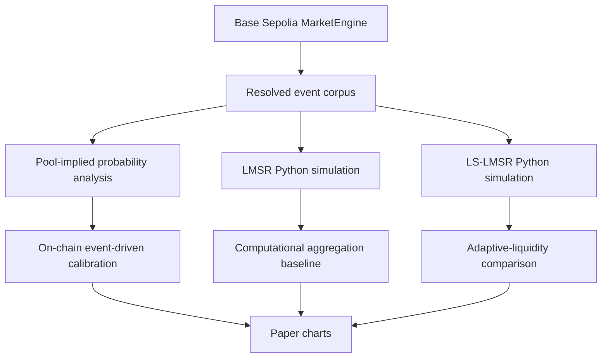

# LMSR and LS-LMSR Python Experiment Plan

**Document purpose:** define the off-chain simulation plan for LMSR and LS-LMSR experiments that support the EDSIS paper.

**Research role:** this file validates the *computational uncertainty-aggregation module* only. It does **not** claim that LMSR or LS-LMSR is deployed inside the current Base Sepolia smart contract.

**Important boundary:** the RetroPick smart contract testnet validation and the LMSR/LS-LMSR experiment are separate layers.

---

## 1. Research framing

The paper should describe this experiment as:

> LMSR and LS-LMSR are evaluated in an off-chain Python simulation using externally resolved event corpora and, where available, the same asset-event rounds exported from the Base Sepolia deployment. The purpose is to test calibration, sensitivity, bounded-loss behavior, and slippage properties of bounded-loss aggregation mechanisms as candidate internal DSS computation modules.

It should **not** say:

> The deployed RetroPick contract implements LMSR/LS-LMSR.

---

## 2. Relationship to smart-contract validation



| Layer | Environment | Purpose |
|---|---|---|
| Smart contract validation | Base Sepolia | lifecycle, oracle, settlement, rolling, governance, auditability |
| Pool-implied calibration | Python using testnet exports | evaluate deployed event-driven signal proxy |
| LMSR simulation | Python | evaluate bounded-loss scoring-rule aggregation |
| LS-LMSR simulation | Python | evaluate adaptive-liquidity behavior under thin participation |

---

## 3. Theory: LMSR

For an `n`-outcome event, the LMSR cost function is:

```math
C(q) = b \log \sum_i \exp(q_i / b)
```

The implied probability of outcome `i` is:

```math
p_i(q) = \frac{\exp(q_i/b)}{\sum_j \exp(q_j/b)}
```

Worst-case loss is bounded by:

```math
B(b,n) = b \log n
```

Interpretation for EDSIS:

| Mathematical object | DSS interpretation |
|---|---|
| `q_i` | accumulated quantity or evidence weight on outcome `i` |
| `p_i(q)` | probability signal used by the decision-support layer |
| `b` | information-cost / sensitivity parameter |
| `B(b,n)` | maximum budget exposed to uncertainty elicitation |
| `C(q + Δe_i)-C(q)` | cost of moving the probability signal |

---

## 4. Theory: LS-LMSR

LMSR uses a fixed liquidity parameter `b`. LS-LMSR makes liquidity adaptive:

```math
b = b(N)
```

where total participation mass is:

```math
N = \sum_i q_i
```

A simple simulation schedule can use:

```math
b(N) = b_0 + \alpha \log(1 + N)
```

or:

```math
b(N) = b_0 + \alpha \sqrt{N}
```

Research interpretation:

- fixed LMSR is easier to reason about and has a simple bounded-loss expression;
- LS-LMSR can reduce thin-market distortion by increasing liquidity as participation grows;
- LS-LMSR must be evaluated carefully because adaptive liquidity changes price sensitivity and budget behavior.

---

## 5. Experiment questions

| ID | Research question | Expected output |
|---|---|---|
| RQ-L1 | How does `b` affect LMSR probability sensitivity? | probability-response curves |
| RQ-L2 | How does `B(b,n)=b log n` scale with outcomes and liquidity? | bounded-loss budget curves |
| RQ-L3 | Does LS-LMSR reduce slippage in thin markets compared with static LMSR? | slippage comparison |
| RQ-L4 | Does LMSR/LS-LMSR improve calibration over fixed priors and rule baselines? | Brier, log score, ECE |
| RQ-L5 | Does improved calibration translate into lower decision regret? | utility/regret charts |
| RQ-L6 | How sensitive are results to agent behavior and participation volume? | ablation table |

---

## 6. Input dataset

The experiment can use three input sources.

### Dataset A — testnet resolved event corpus

Exported from Base Sepolia smart contract validation.

Required fields:

```csv
event_id,market_type,asset_pair,lock_time,resolve_time,
checkpoint_a_value,checkpoint_b_value,
outcome_count,winning_outcome,
pool_0,pool_1,total_pool
```

Use this for:

- comparing pool-implied probabilities vs LMSR/LS-LMSR simulated probabilities;
- matching simulation to actual resolved rounds;
- creating paper charts that share the same event corpus.

### Dataset B — historical or replayed asset prices

Use for larger sample sizes when testnet rounds are too few.

Required fields:

```csv
timestamp,asset_pair,price
```

Transform into synthetic event templates:

```text
Direction: price_resolve > price_lock
Threshold: price_resolve >= threshold
RangeClose: price_resolve in range bin
Velocity: abs(price_resolve - price_lock) / price_lock
```

### Dataset C — synthetic agent simulation

Use generated agents when real trader behavior is not available.

Agent parameters:

| Parameter | Meaning |
|---|---|
| `belief_accuracy` | probability that agent leans toward the true outcome |
| `noise_sigma` | noise added to belief |
| `budget_distribution` | stake or quantity budget distribution |
| `arrival_process` | uniform, Poisson, bursty, late-arrival |
| `risk_aversion` | controls trade aggressiveness |
| `participation_level` | thin, medium, thick market |

---

## 7. Baselines

| Model | Description | Purpose |
|---|---|---|
| Fixed prior | always predicts `1/n` | lower bound baseline |
| Rule threshold | deterministic rule converted to probability | simple non-market baseline |
| Pool-implied | `pool_i / totalPool` from deployed event engine | actual contract-proxy signal |
| Static LMSR | fixed `b` | canonical bounded-loss AMM |
| LS-LMSR | adaptive `b(N)` | liquidity-sensitive variant |

---

## 8. Simulation procedure

### Step 1 — load events

```python
events = load_event_corpus("resolved_epochs.csv")
```

### Step 2 — initialize model

```python
model = LMSR(b=5.0, n_outcomes=2)
# or
model = LSLMSR(b0=2.0, alpha=1.5, schedule="log")
```

### Step 3 — simulate participants

```python
for event in events:
    agents = generate_agents(event, participation_level="thin")
    for agent in agents:
        outcome = agent.choose_outcome(event)
        quantity = agent.choose_quantity()
        model.buy(outcome, quantity)
    p = model.probabilities()
    record_prediction(event.id, p)
```

### Step 4 — score resolved outcomes

```python
scores = evaluate_predictions(predictions, outcomes)
```

### Step 5 — produce charts

```python
plot_reliability_diagram(predictions, outcomes)
plot_brier_by_model(scores)
plot_slippage_curves(results)
plot_bounded_loss_curves()
```

---

## 9. Core formulas

### LMSR trade cost

```math
\operatorname{cost}(q, i, \Delta) =
C(q + \Delta e_i) - C(q)
```

### Average execution price

```math
\bar{p}_{i,\Delta} =
\frac{C(q+\Delta e_i)-C(q)}{\Delta}
```

### Slippage

```math
s(i,q,\Delta)=
\frac{C(q+\Delta e_i)-C(q)}{\Delta} - p_i(q)
```

### Binary Brier score

```math
BS = \frac{1}{M}\sum_{m=1}^{M}(p_m-o_m)^2
```

### Multiclass Brier score

```math
BS_{multi} =
\frac{1}{M}\sum_{m=1}^{M}\sum_{i=1}^{n}(p_{m,i}-o_{m,i})^2
```

### Log score

```math
LS = -\frac{1}{M}\sum_{m=1}^{M}\log(p_{m,y_m})
```

### Expected Calibration Error

```math
ECE =
\sum_{b=1}^{B}
\frac{|B_b|}{M}
\left|
\operatorname{acc}(B_b) -
\operatorname{conf}(B_b)
\right|
```

### Expected utility

```math
EU(\operatorname{act}\mid p) = p u_{TP} + (1-p)u_{FP}
```

```math
EU(\operatorname{wait}\mid p) = p u_{FN} + (1-p)u_{TN}
```

### Regret

```math
Regret = U(a^*) - U(a_{\text{model}})
```

---

## 10. Experiment matrix

| Experiment | Models | Dataset | Metrics | Chart |
|---|---|---|---|---|
| E1 probability response | LMSR with `b ∈ {2,5,10}` | synthetic imbalance | `p_i(q)` | probability response curve |
| E2 bounded loss | LMSR | parameter grid | `B(b,n)` | loss surface / line chart |
| E3 static vs adaptive slippage | LMSR, LS-LMSR | synthetic trades | `s(i,q,Δ)` | slippage curve |
| E4 calibration | fixed prior, pool-implied, LMSR, LS-LMSR | resolved events | Brier, ECE, log score | reliability diagram |
| E5 thin-market stress | LMSR, LS-LMSR | low participation agents | probability volatility, slippage | volatility chart |
| E6 participation scaling | LMSR, LS-LMSR | thin/medium/thick agents | Brier, ECE, slippage | ablation table |
| E7 decision utility | all models | scenario payoff matrix | regret, expected utility | utility bar chart |
| E8 sensitivity analysis | LMSR, LS-LMSR | parameter sweep | all metrics | heatmap |

---

## 11. Parameter grid

### LMSR

| Parameter | Values |
|---|---|
| `b` | `1, 2, 5, 10, 25, 50` |
| `n` | `2, 3, 4, 8` |
| `Δ` | `0.1, 0.5, 1, 2, 5, 10` |

### LS-LMSR

| Parameter | Values |
|---|---|
| `b0` | `0.5, 1, 2, 5` |
| `alpha` | `0.1, 0.5, 1, 2, 5` |
| schedule | `log`, `sqrt`, `linear-capped` |
| participation | `thin`, `medium`, `thick` |

---

## 12. Python project structure

Recommended folder:

```text
experiments/
  calibration/
    README.md
    data/
      resolved_epochs.csv
      synthetic_events.csv
    src/
      lmsr.py
      ls_lmsr.py
      agents.py
      metrics.py
      plots.py
      run_all.py
    notebooks/
      01_lmsr_response.ipynb
      02_bounded_loss.ipynb
      03_slippage.ipynb
      04_calibration.ipynb
      05_decision_utility.ipynb
    outputs/
      figures/
      tables/
      metrics.json
```

---

## 13. Minimal implementation sketch

```python
import numpy as np

class LMSR:
    def __init__(self, n, b):
        self.n = n
        self.b = float(b)
        self.q = np.zeros(n)

    def cost(self, q=None):
        q = self.q if q is None else np.asarray(q, dtype=float)
        z = q / self.b
        m = np.max(z)
        return self.b * (m + np.log(np.sum(np.exp(z - m))))

    def probs(self):
        z = self.q / self.b
        z -= np.max(z)
        e = np.exp(z)
        return e / e.sum()

    def buy(self, outcome, delta):
        before = self.cost()
        q2 = self.q.copy()
        q2[outcome] += delta
        after = self.cost(q2)
        self.q = q2
        return after - before

class LSLMSR(LMSR):
    def __init__(self, n, b0, alpha, schedule="log"):
        self.n = n
        self.b0 = float(b0)
        self.alpha = float(alpha)
        self.schedule = schedule
        self.q = np.zeros(n)

    def current_b(self, q=None):
        q = self.q if q is None else np.asarray(q, dtype=float)
        N = np.sum(np.maximum(q, 0.0))
        if self.schedule == "log":
            return self.b0 + self.alpha * np.log1p(N)
        if self.schedule == "sqrt":
            return self.b0 + self.alpha * np.sqrt(N)
        raise ValueError("unknown schedule")

    def cost(self, q=None):
        q = self.q if q is None else np.asarray(q, dtype=float)
        b = self.current_b(q)
        z = q / b
        m = np.max(z)
        return b * (m + np.log(np.sum(np.exp(z - m))))

    def probs(self):
        b = self.current_b()
        z = self.q / b
        z -= np.max(z)
        e = np.exp(z)
        return e / e.sum()
```

---

## 14. Metrics implementation sketch

```python
def brier_binary(p, y):
    p = np.asarray(p)
    y = np.asarray(y)
    return np.mean((p - y) ** 2)

def brier_multiclass(P, Y):
    P = np.asarray(P)
    Y = np.asarray(Y)
    return np.mean(np.sum((P - Y) ** 2, axis=1))

def ece_binary(p, y, n_bins=10):
    p = np.asarray(p)
    y = np.asarray(y)
    bins = np.linspace(0, 1, n_bins + 1)
    total = len(p)
    ece = 0.0
    for lo, hi in zip(bins[:-1], bins[1:]):
        mask = (p >= lo) & (p < hi) if hi < 1 else (p >= lo) & (p <= hi)
        if mask.sum() == 0:
            continue
        conf = p[mask].mean()
        acc = y[mask].mean()
        ece += (mask.sum() / total) * abs(acc - conf)
    return ece
```

---

## 15. Chart outputs

| File | Description |
|---|---|
| `fig_lmsr_probability_response.png` | probability response for `b = 2, 5, 10` |
| `fig_bounded_loss_budget.png` | `B(b,n)=b log n` |
| `fig_slippage_static_vs_adaptive.png` | LMSR vs LS-LMSR slippage |
| `fig_reliability_by_model.png` | calibration reliability diagram |
| `fig_brier_ece_by_model.png` | model comparison |
| `fig_decision_regret_by_model.png` | expected utility / regret comparison |
| `table_parameter_sensitivity.csv` | parameter sweep results |
| `table_model_scores.csv` | final score table |

---

## 16. Reporting language for the paper

Use:

> LMSR and LS-LMSR were evaluated in a Python simulation rather than on-chain because the deployed RetroPick MarketEngine uses an event-driven pooled settlement design. The simulation replays externally resolved events and agent-generated participation traces through static and adaptive scoring-rule mechanisms. Probability quality is measured using Brier score, log score, Expected Calibration Error, and reliability diagrams. Liquidity behavior is measured using bounded-loss and slippage curves. This separation avoids conflating the deployed lifecycle artifact with a computational aggregation mechanism that is not implemented in the current contract.

Do not use:

> The deployed protocol uses LMSR.

Do not use:

> LS-LMSR testnet results prove slippage reduction.

Use instead:

> LS-LMSR simulation suggests how adaptive liquidity could behave if introduced as a future computational module.

---

## 17. Limitations

| Limitation | Treatment |
|---|---|
| Agent behavior is synthetic | report agent assumptions and run sensitivity analysis |
| Testnet incentives are artificial | do not claim real user forecasting wisdom |
| LS-LMSR schedule is implementation-dependent | test multiple `b(N)` schedules |
| Historical/replayed asset paths may not represent future regimes | include robustness checks |
| Pool-implied probabilities are not LMSR prices | report separately |
| On-chain contract does not implement LMSR | state explicitly in methodology |

---

## 18. Final deliverables

The experiment should produce:

1. `resolved_epochs.csv`
2. `model_predictions.csv`
3. `model_scores.csv`
4. `fig_lmsr_probability_response.png`
5. `fig_bounded_loss_budget.png`
6. `fig_slippage_static_vs_adaptive.png`
7. `fig_reliability_by_model.png`
8. `fig_brier_ece_by_model.png`
9. `fig_decision_regret_by_model.png`
10. `experiment_summary.md`

---

## 19. Source notes

- Hanson LMSR: cost-function market scoring rules, implied probabilities, and bounded loss.
- Othman, Sandholm, Pennock, and Reeves: liquidity-sensitive automated market-maker research.
- Calibration evaluation: Brier score, Expected Calibration Error, and reliability diagrams.
- RetroPick EDSIS paper: LMSR/LS-LMSR treated as internal computational modules subordinate to the event-driven DSS architecture.
