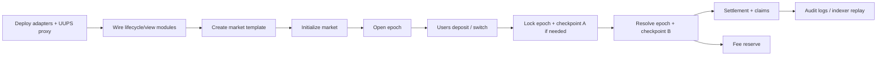
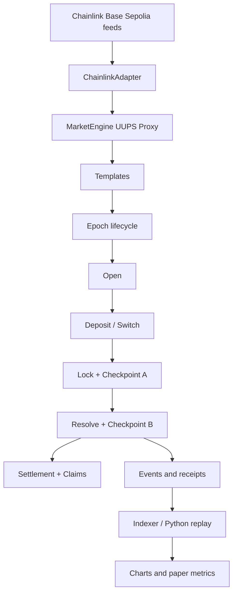
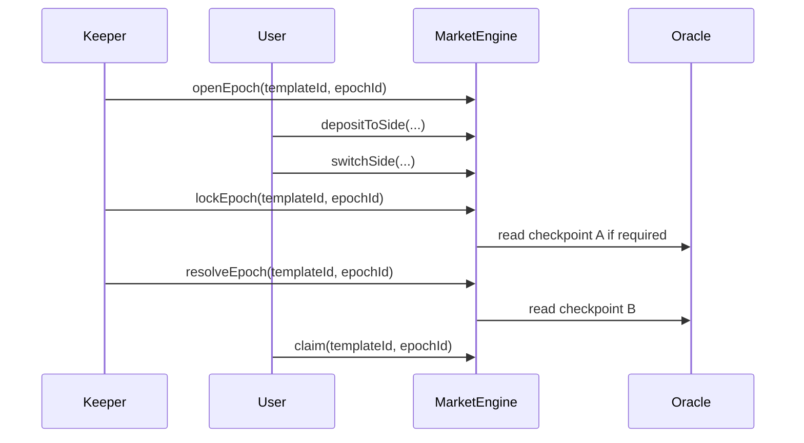
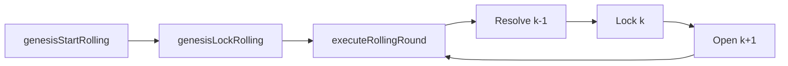

# RetroPick Smart Contract Validation Plan

**Document purpose:** define a research-grade validation plan for the current RetroPick `MarketEngine` smart contract on **Base Sepolia**.

**Research role:** this file validates the *event-driven smart information system* layer of the ICENIS EDSIS paper: lifecycle correctness, external attestation, rolling orchestration, governance/recovery, auditability, and pool-implied calibration.

**Important boundary:** the deployed smart contract is an **event-driven pooled prediction-market lifecycle engine**. It is **not** an on-chain LMSR or LS-LMSR automated market maker. LMSR/LS-LMSR must be evaluated separately in Python simulation.

---

## 1. Research framing

The Base Sepolia experiment should be framed as:

> The deployed RetroPick MarketEngine validates the event-driven, oracle-governed lifecycle of externally resolved uncertainty objects. It tests whether templates, epochs, oracle checkpoints, rolling execution, settlement, claims, governance controls, and replayable audit logs can support a smart information system for uncertainty-aware decision support.

It should **not** be framed as:

> The deployed contract proves LMSR or LS-LMSR market-maker performance.

That claim belongs to the separate Python simulation file.

---

## 2. Current smart contract model

The current implementation is best understood as a modular event-driven engine:



### Information-system mapping

| Smart-contract object | Information Systems interpretation | Research role |
|---|---|---|
| `Template` | Reusable uncertainty-object schema | Defines asset, market type, oracle feed, timing, fees, bounds, governance |
| `Epoch` | Time-bounded decision episode | One open → lock → resolve → claim cycle |
| `Checkpoint A` | Lock-time external evidence sample | Used for direction / velocity / convergence / composite comparisons |
| `Checkpoint B` | Resolve-time external evidence sample | Used for final outcome resolution |
| `Oracle adapter` | External attestation interface | Converts external asset-feed truth into deterministic system state |
| `Rolling keeper` | Event-driven orchestration agent | Bundles resolve + lock + open into one controlled transition |
| `Ledger` | Template-level lifecycle cursor and reserve state | Tracks active epoch, resolved epoch, rolling phase, reserves |
| `Indexer` | Observability and replay subsystem | Reconstructs events, outcomes, claims, and metrics |
| `Operator dashboard` | Human governance interface | Supports admin, worker, recovery, and monitoring workflows |

---

## 3. Base Sepolia Chainlink feed set

Use the following asset feeds as the available external-attestation substrate.

| Pair | Base Sepolia feed address | Recommended test role |
|---|---|---|
| BTC / USD | `0x0FB99723Aee6f420beAD13e6bBB79b7E6F034298` | Direction, Threshold, RangeClose, Velocity, Ladder |
| CBETH / ETH | `0x91b21900E91CD302EBeD05E45D8f270ddAED944d` | Ratio-style threshold |
| CBETH / USD | `0x3c65e28D357a37589e1C7C86044a9f44dDC17134` | Convergence with ETH/USD |
| DAI / USD | `0xD1092a65338d049DB68D7Be6bD89d17a0929945e` | Stable threshold, composite control |
| ETH / USD | `0x4aDC67696bA383F43DD60A9e78F2C97Fbbfc7cb1` | Direction, Threshold, RangeClose, Velocity, Ladder |
| LINK / ETH | `0x56a43EB56Da12C0dc1D972ACb089c06a5dEF8e69` | Relative asset threshold |
| LINK / USD | `0xb113F5A928BCfF189C998ab20d753a47F9dE5A61` | Direction, Threshold, Velocity |
| USDC / USD | `0xd30e2101a97dcbAeBCBC04F14C3f624E67A35165` | Stable threshold, freshness, composite control |

### Oracle caution

Chainlink Data Feeds are suitable for external attestation because they aggregate real-world market data and publish it onchain through decentralized oracle infrastructure. However, they are not tick-by-tick streams. Feed freshness must be measured with `updatedAt`, and very short epochs may resolve against repeated values if the underlying feed does not update during the test window.

---

## 4. Market-type validation coverage

The contract's consolidated canonical market taxonomy should be tested according to what the deployed engine actually supports.

| Market type | Base Sepolia Chainlink asset-feed validation | Rolling mode | Test status |
|---|---:|---:|---|
| `Direction` | Yes | Yes | Primary |
| `Threshold` | Yes | Yes | Primary |
| `RangeClose` | Yes | Yes | Primary |
| `Velocity` | Yes | Yes | Primary |
| `Ladder` | Yes | Yes | Primary |
| `Convergence` | Yes, two Chainlink feeds | No | Manual only |
| `Composite` | Yes, carefully with similar-scale feeds | No | Manual only |
| `Corridor` | Not with Chainlink-only | No | Skip unless TrustedReporter OHLC exists |
| `Cascade` | Not with Chainlink-only | No | Skip unless TrustedReporter OHLC exists |

### Recommended scope for the paper

For ICENIS charts, prioritize:

1. `Direction`
2. `Threshold`
3. `RangeClose`
4. `Velocity`
5. `Ladder`
6. `Convergence` as manual-only two-feed proof
7. `Composite` as manual-only multi-feed proof
8. `Corridor` / `Cascade` documented as **not validated on Chainlink-only asset feeds**

---

## 5. Research hypotheses

| ID | Hypothesis | Environment | Primary metric |
|---|---|---|---|
| H1 | Event-driven lifecycle transitions execute correctly across market types | Base Sepolia | state mismatch rate |
| H2 | Rolling execution reduces keeper orchestration overhead vs manual sequencing | Base Sepolia | tx count, gas, resolution lag |
| H3 | Chainlink attestation can resolve externally verified asset events with freshness checks | Base Sepolia | freshness seconds, stale rejection rate |
| H4 | Settlement and claims match off-chain recomputation | Base Sepolia + Python replay | settlement mismatch rate |
| H5 | Governance controls constrain unsafe operations | Base Sepolia / local fork | unauthorized-action rate, time-to-halt |
| H6 | On-chain event logs are sufficient for replayable auditability | Indexer + Python | replay completeness |
| H7 | Pool-implied probability can be evaluated as a preliminary calibration signal | Base Sepolia + Python | Brier score, ECE, reliability diagram |

---

## 6. Test architecture



---

## 7. Test phases

### Phase A — deployment validation

**Goal:** prove the protocol instance is reproducibly deployable.

| Step | Expected output |
|---|---|
| Deploy `ChainlinkAdapter` | adapter address |
| Deploy UUPS `MarketEngineDispatcher` proxy | proxy + implementation address |
| Deploy lifecycle/view modules | module addresses |
| Register delegated selectors | selector registry complete |
| Set admin, treasury, worker | role config recorded |
| Set oracle adapter | price oracle configured |
| Save registry | deployment release record |

**Metrics**

- deployment success rate
- gas per deployment component
- selector count
- registry completeness
- role-address correctness

**Chart**

```text
Figure: Deployment component vs gas used
```

---

### Phase B — template validation

**Goal:** prove templates are reusable uncertainty-object schemas.

Create templates:

| Template | Market type | Feed(s) |
|---|---|---|
| BTC Direction | `Direction` | BTC/USD |
| ETH Direction | `Direction` | ETH/USD |
| BTC Threshold | `Threshold` | BTC/USD |
| ETH RangeClose | `RangeClose` | ETH/USD |
| LINK Velocity | `Velocity` | LINK/USD |
| BTC Ladder | `Ladder` | BTC/USD |
| CBETH/ETH Convergence | `Convergence` | CBETH/USD + ETH/USD |
| DAI/USDC Composite | `Composite` | DAI/USD + USDC/USD |

**Negative tests**

- zero feed address must revert
- invalid outcome count must revert
- non-increasing range bounds must revert
- rolling `Convergence` must revert
- rolling `Composite` must revert
- Chainlink-only `Corridor` and `Cascade` are excluded from formal validation

**Metrics**

- template acceptance rate
- invalid template rejection rate
- initialization success rate
- config mismatch count

---

### Phase C — manual lifecycle validation

**Goal:** validate the canonical lifecycle.



**Assertions**

| Assertion | Expected result |
|---|---|
| `Open -> Locked -> Resolved` | valid sequence |
| deposit after lock | revert |
| claim before resolution | revert |
| off-chain winner == on-chain winner | true |
| off-chain claim amount == on-chain claim amount | true |
| all events replayable | true |

---

### Phase D — rolling execution validation

**Goal:** compare manual 3-call orchestration against rolling 1-call orchestration.

Rolling-compatible test set:

- `Direction`
- `Threshold`
- `RangeClose`
- `Velocity`
- `Ladder`

Flow:



**Comparison table**

| Mode | Lifecycle operations | Keeper transactions |
|---|---|---:|
| Manual | open + lock + resolve | 3 |
| Rolling | resolve previous + lock current + open next | 1 |

**Metrics**

- `tx_count_per_epoch`
- `gas_per_epoch`
- `actual_resolve_time - scheduled_resolveAt`
- missed-deadline rate
- rolling halt rate
- keeper success rate

**Charts**

- manual vs rolling transaction count
- manual vs rolling gas per resolved epoch
- resolution lag distribution
- missed-deadline rate by mode

---

### Phase E — oracle freshness and resolution validation

**Goal:** validate external-attestation correctness.

Collect:

| Field | Source |
|---|---|
| `roundId` | Chainlink feed / adapter extension if available |
| `answer` | `latestRoundData()` |
| `updatedAt` | `latestRoundData()` |
| `block.timestamp` | transaction receipt |
| `checkpointA.publishTime` | epoch state |
| `checkpointB.publishTime` | epoch state |
| `oracle_freshness_seconds` | `block.timestamp - updatedAt` |

**Metrics**

```text
freshness_seconds = resolve_tx_timestamp - chainlink_updatedAt
stale_rejection_rate = stale_reverts / stale_attempts
oracle_cursor_regression_count = count(roundId_t <= roundId_{t-1})
```

**Chart**

```text
Figure: Oracle freshness histogram by asset feed
```

---

### Phase F — settlement and claim correctness

**Goal:** prove on-chain settlement matches off-chain recomputation.

For each resolved epoch:

```text
winner_offchain = resolver(checkpointA, checkpointB, template_params)
winner_onchain  = epoch.winningOutcomeMask
mismatch        = winner_offchain != winner_onchain
```

For claims:

```text
claim_offchain = recompute(position, pools, fees, winningOutcomeMask)
claim_onchain  = emitted_or_observed_claim_amount
claim_error    = abs(claim_offchain - claim_onchain)
```

**Metrics**

- settlement mismatch rate
- max claim error
- mean claim error
- fee accounting mismatch
- unresolved epoch count

---

### Phase G — pool-implied probability calibration

**Goal:** evaluate the deployed event-driven engine's preliminary probabilistic signal.

Because the contract is pooled-event-driven rather than LMSR-based, define:

```math
p_i = \frac{pool_i}{\sum_j pool_j}
```

For binary markets:

```math
p_{yes} = \frac{yesPool}{yesPool + noPool}
```

Outcome encoding:

```math
o_i =
\begin{cases}
1 & \text{if outcome } i \text{ wins} \\
0 & \text{otherwise}
\end{cases}
```

Brier score:

```math
BS = \frac{1}{M}\sum_{m=1}^{M}(p_m - o_m)^2
```

Expected Calibration Error:

```math
ECE = \sum_b \frac{|B_b|}{M}\left|\operatorname{acc}(B_b)-\operatorname{conf}(B_b)\right|
```

**Important research wording**

> This calibration analysis evaluates the pool-implied probability proxy of the event-driven deployed engine. It does not evaluate LMSR or LS-LMSR on-chain.

**Charts**

- reliability diagram
- Brier score by market type
- ECE by market type
- calibration sample count by bin

---

### Phase H — fault injection and recovery

| Fault | Method | Expected response | Metric |
|---|---|---|---|
| Stale oracle | set `maxAgeSeconds` too low | reject or halt | stale rejection rate |
| Late keeper | wait beyond rolling buffer | rolling halted | time-to-halt |
| Unauthorized admin | call admin from non-admin | revert | unauthorized-action rate |
| Unauthorized worker | call keeper from wrong key | revert | unauthorized-action rate |
| Claim before resolution | claim early | revert | invalid-claim rejection |
| Deposit after lock | deposit late | revert | invalid-deposit rejection |
| Rolling `Convergence` | configure rolling convergence | revert | invalid-template rejection |
| Rolling `Composite` | configure rolling composite | revert | invalid-template rejection |
| Bad oracle feed | use zero/malformed feed | revert | invalid-feed rejection |

**Charts**

- fault response matrix
- recovery time by fault
- unauthorized action rejection count

---

## 8. Data schema

Export one row per resolved epoch:

```csv
chain_id,engine_address,template_id,template_slug,market_type,asset_pair,feed_address,
epoch_id,execution_mode,open_at,lock_at,resolve_at,
actual_open_tx_time,actual_lock_tx_time,actual_resolve_tx_time,
checkpoint_a_value_e8,checkpoint_a_publish_time,
checkpoint_b_value_e8,checkpoint_b_publish_time,
oracle_round_a,oracle_round_b,oracle_freshness_seconds,
outcome_count,pool_0,pool_1,pool_2,pool_3,pool_4,pool_5,pool_6,pool_7,total_pool,
pool_implied_p_0,pool_implied_p_1,pool_implied_p_2,pool_implied_p_3,
winning_outcome_mask,claim_liability_total,settlement_fee_total,
gas_open,gas_lock,gas_resolve,gas_rolling,gas_claim,
halt_reason,recovery_time_seconds,settlement_mismatch,claim_error
```

---

## 9. Minimum viable sample size

For engineering validation:

```text
5 market types × 10 epochs = 50 resolved epochs
```

For conference charts:

```text
5 market types × 30 epochs = 150 resolved epochs
```

For stronger calibration:

```text
5 market types × 100 epochs = 500 resolved epochs
```

Short rounds are acceptable for lifecycle validation, but calibration charts become meaningful only with enough resolved outcomes and enough probability-bin coverage.

---

## 10. Final chart list for paper

| Figure | Dataset | Purpose |
|---|---|---|
| Market-type validation matrix | test registry | show what is tested on-chain vs skipped |
| Manual vs rolling transaction count | receipts | prove orchestration reduction |
| Manual vs rolling gas per epoch | receipts | prove keeper-cost difference |
| Resolution lag distribution | receipts + schedule | measure timeliness |
| Oracle freshness histogram | Chainlink `updatedAt` | measure external-attestation timeliness |
| Settlement mismatch chart | off-chain recomputation | prove resolver correctness |
| Reliability diagram | pool-implied probabilities | evaluate preliminary calibration |
| Brier/ECE by market type | resolved epochs | quantify probabilistic quality |
| Fault response matrix | fault injection | prove governance and recovery |

---

## 11. Acceptance criteria

| Area | Pass criterion |
|---|---|
| Deployment | all required addresses recorded in release registry |
| Template validation | all valid templates accepted, all invalid templates rejected |
| Lifecycle | no invalid state transition succeeds |
| Oracle | all resolved epochs have valid feed observation and freshness record |
| Settlement | zero winner mismatch against off-chain recomputation |
| Claims | claim error within rounding tolerance |
| Rolling | rolling tx count lower than manual baseline |
| Fault injection | unsafe calls rejected or halted |
| Audit | indexer/Python replay reconstructs all resolved epochs |
| Calibration | reliability/Brier/ECE reported honestly as pool-implied proxy |

---

## 12. Paper-ready methodology paragraph

> The Base Sepolia experiment evaluates the deployed event-driven MarketEngine as an externally resolved smart-information-system artifact. The on-chain experiment validates template creation, epoch lifecycle semantics, Chainlink oracle checkpointing, rolling orchestration, settlement correctness, claim processing, and governance/recovery controls. Because the deployed contract does not implement LMSR or LS-LMSR as an on-chain automated market maker, those mechanisms are evaluated separately in Python simulation. For the deployed event-driven engine, probabilistic quality is measured through a pool-implied probability proxy computed from pre-lock outcome pools and evaluated against realized outcomes using Brier score, Expected Calibration Error, and reliability diagrams.

---

## 13. Source notes

- RetroPick current `MarketEngine` technical reference: uploaded project markdown.
- EDSIS paper evaluation protocol: uploaded ICENIS paper draft.
- Chainlink Data Feeds are used as the external-attestation source for asset-feed outcomes.
- Calibration metrics follow standard probabilistic-forecast evaluation: Brier score, ECE, and reliability diagrams.
